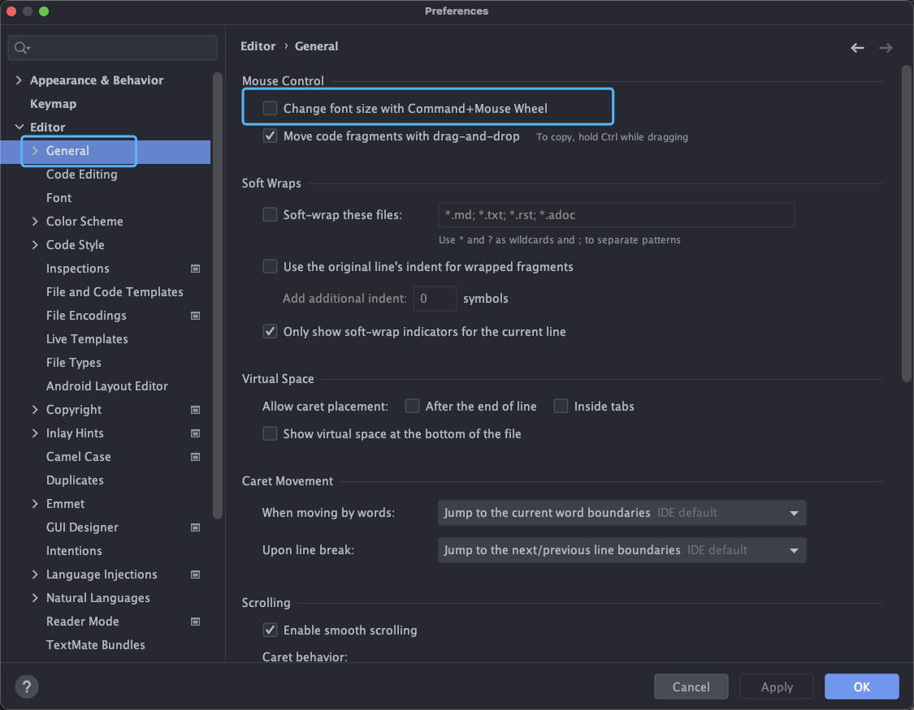
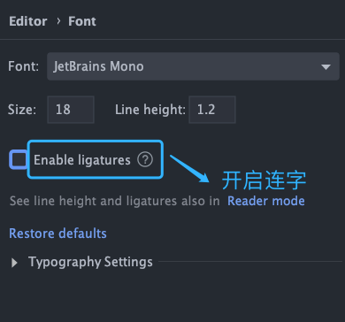
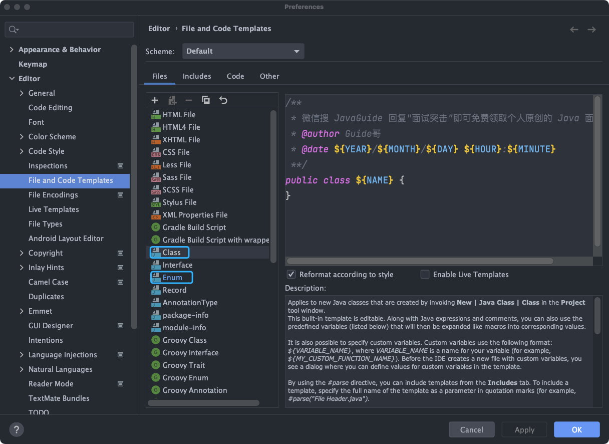
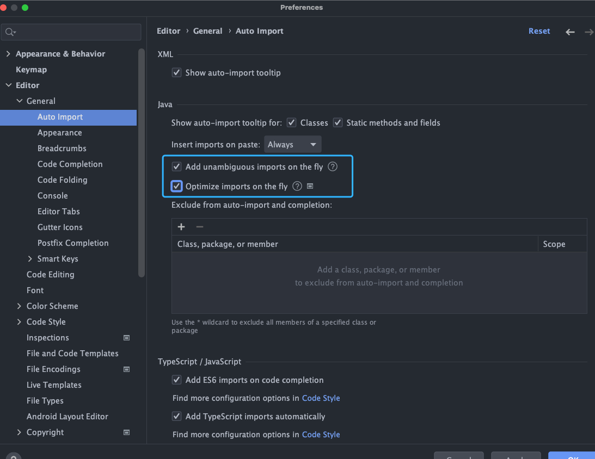

## idea配置

### 1. 调整窗口字体显示大小

勾选上 Preferences / Settings | Editor | General 下的 Change font size with Command + Mouse Wheel 选项之后，我们就可以直接使用 ⌘+鼠标滚轮（Mac）/ Ctrl+鼠标滚轮(Windows&Linux)来更改窗口字体的大小



### 2.字体设置

修改 Preferences / Settings | Editor | Font 选项下的字体设置，字体推荐使用 JetBrains Mono ，字体大小建议 16/18，根据个人需要选择是否需要开启连字。



### 3.配置类注释模板

修改 Preferences / Settings | Editor | File adn Code Templates 下的 Class 和 Enum 的模板。



我的日常项目的类注释模板配置为:

```csharp
/**
 * 
 * @author Guide哥
 * @date ${YEAR}/${MONTH}/${DAY} ${HOUR}:${MINUTE}
 **/
public class ${NAME} {
}
```

### 4.自动导包&删除无用包

勾选上 Preferences / Settings | Editor | General | Auto Import 下的指定选项即可！



这样设置之后，IDEA 会自动帮你导包（唯一确定的时候才会生效）以及删除代码中没用到的包。

