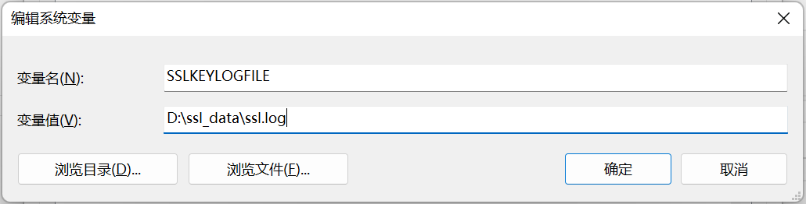
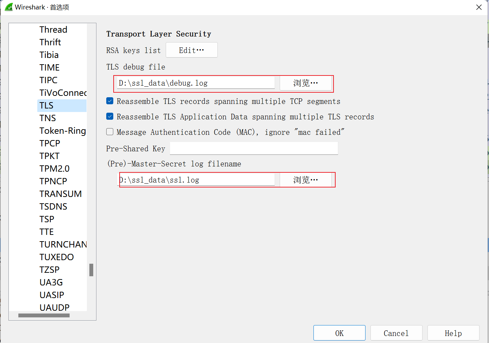

## wireshark抓包工具

> 是一个网络封包分析软件。网络封包分析软件的功能是截取网络封包

#### 1.下载\安装

[wireshark.exe](../../assets/1659272792659.exe)

#### 2.wireshark常用过滤规则

> 可使用单个或多个过滤条件（可使用==，>=等），多个条件时使用and or进行连接

```shell
#过滤IP，如来源IP或者目标IP等于某个IP
ip.src ==192.168.1.107 or ip.dst ==192.168.1.107

#过滤端口
tcp.port eq 80 # 不管端口是来源的还是目标的都显示
tcp.port == 80
tcp.dstport == 80 #只显tcp协议的目标端口80tcp.srcport == 80  只显tcp协议的来源端口80
#过滤端口范围tcp.port >= 1 and tcp.port <= 80

#过滤协议
tcp udp arp icmp http smtp ftp dns #排除arp包，如!arp   或者   not arp

#http模式过滤
http.request.method == “GET”
http.request.method == “POST”
http.request.uri == “/img/logo-edu.gif”
http contains “GET”
http contains “HTTP/1.”
```

#### 2. 使用wireshark抓https明文包

> 一般https包都加密的,要想使用wireshark抓明文包,可以通过设置`SSLKEYLOGFILE`环境变量，指定浏览器在访问`SSL/TLS`网站时将对应的密钥保存到本地文件中

1. 首先设置`SSLKEYLOGFILE`环境变量

   

2. 配置(wireshake-> 首选项->Protocls->TLS)

   

   

