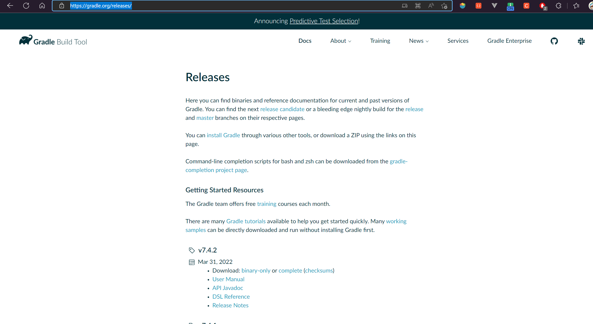
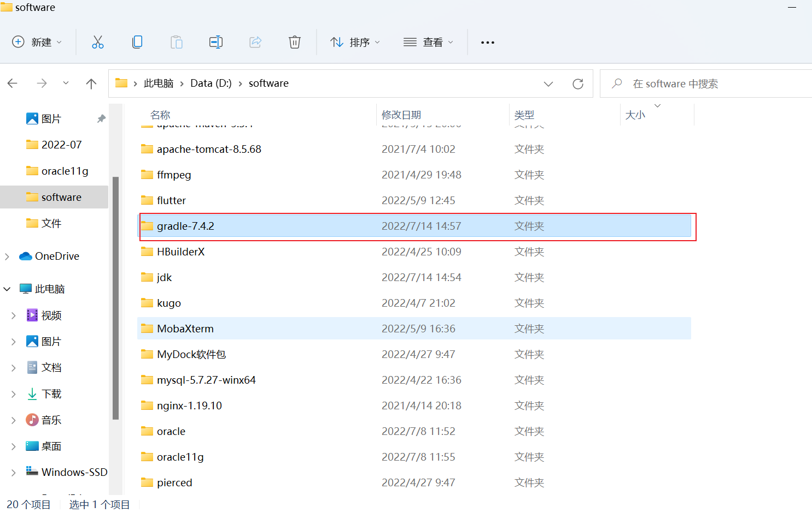
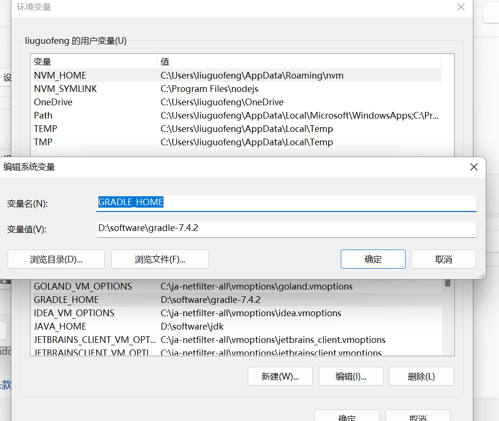
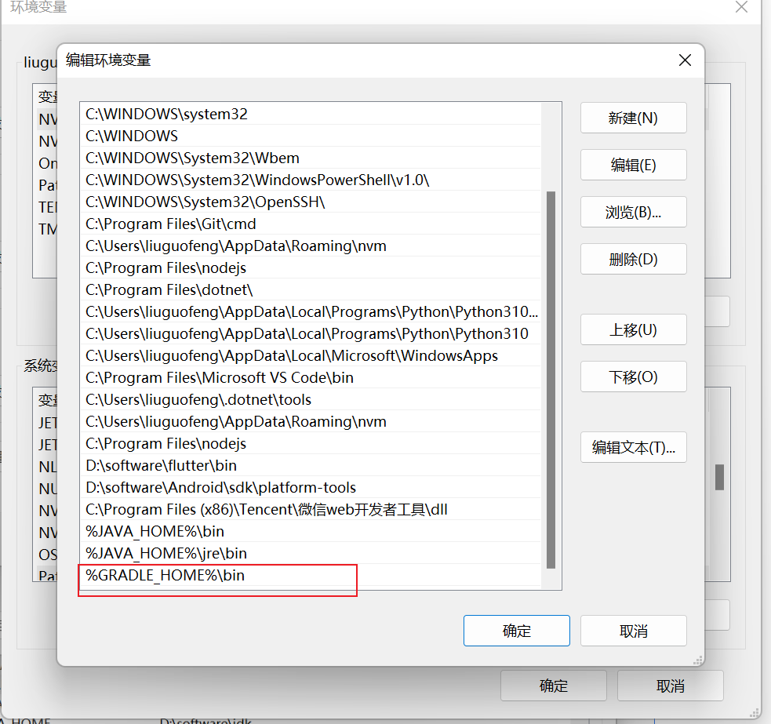
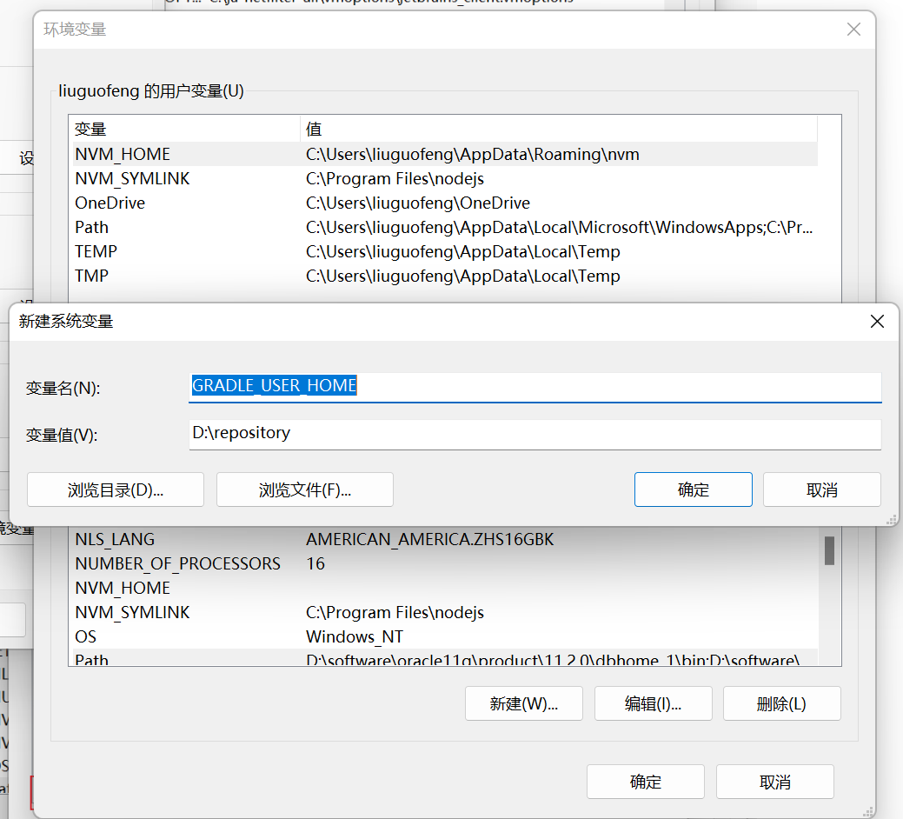

## gradle 配置和安装

#### 1.下载

https://gradle.org/releases/



#### 2.解压



#### 3.配置环境变量

###### 1.配置`GRADLE_HOME` 为 解压目录



###### 2.配置path为`%GRADLE_HOME%\bin`



###### 3.配置gradle本地仓库地址`GRADLE_USER_HOME`



> gradle -v 或者 gradle --version: 通过gradle -v或者 gradle --version检测是否安装成功


#### 4.修改maven 下载源

> Gradle 自带的Maven 源地址是国外的，该Maven 源在国内的访问速度是很慢的，除非使用了特别的手段。一般情况下，我们建议使用国内的第三方开放的Maven 源或企业内部自建Maven 源。
>
> 在init.d 文件夹创建init.gradle 文件

```java
allprojects {
    repositories {
        mavenLocal()
        maven { name "Alibaba" ; url "https://maven.aliyun.com/repository/public" } 
        maven { name "Bstek" ; url "https://nexus.bsdn.org/content/groups/public/" } 
        mavenCentral()
    }
    
    buildscript {
        repositories {
            maven { name "Alibaba" ; url 'https://maven.aliyun.com/repository/public' } 
            maven { name "Bstek" ; url 'https://nexus.bsdn.org/content/groups/public/' } 
            maven { name "M2" ; url 'https://plugins.gradle.org/m2/' }
        }
    }
}
```


