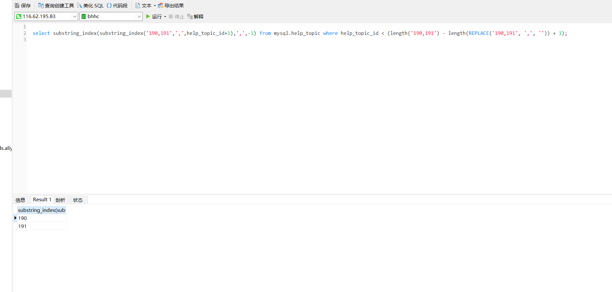

## sql 把字符串转集合 substring_index 实现 java 中 split

```sql
select substring_index(substring_index('190,191',',',help_topic_id+1),',',-1)
 from mysql.help_topic where help_topic_id < (length('190,191') - length(REPLACE('190,191', ',', '')) + 1);
```





如:其中chk_doctor_check是表明，check_result_file是逗号字符串


```sql
SELECT
    substring_index(
        substring_index(
            a.check_result_file,
            ',',
            b.help_topic_id + 1
        ),
        ',' ,- 1
    ) AS shareholder
FROM
    (select check_result_file from chk_doctor_check  where check_result_file is not null) a
JOIN mysql.help_topic b ON b.help_topic_id < (
    length(a.check_result_file) - length(
        REPLACE (a.check_result_file, ',', '')
    ) + 1
)
```

