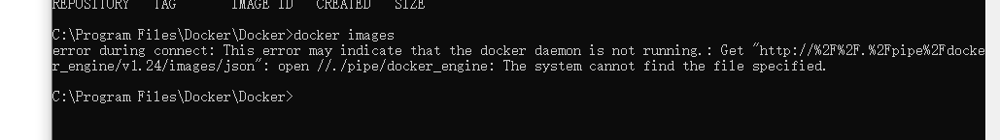
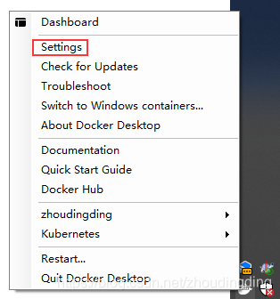
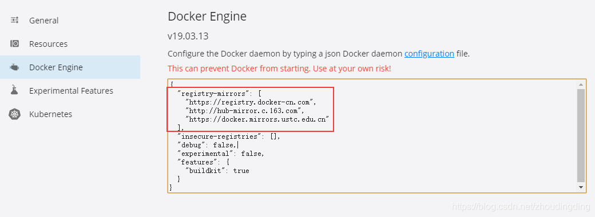

## windows下安装并配置docker

####  1.下载

 https://docs.docker.com/docker-for-windows/install/

问题1.守护线程未启动问题



```shell
DockerCli.exe -SwitchDaemon
```

####  2.配置阿里云仓库

1. 右键托盘图标 - 设置




2. 修改Docker Engine配置，增加镜像仓库地址




```shell
{
  "registry-mirrors": [
    "https://registry.docker-cn.com",
    "http://hub-mirror.c.163.com",
    "https://docker.mirrors.ustc.edu.cn"
  ],
  "insecure-registries": [],
  "debug": false,
  "experimental": false,
  "features": {
    "buildkit": true
  }
}
```

