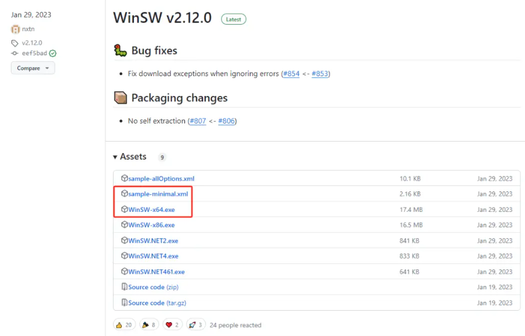
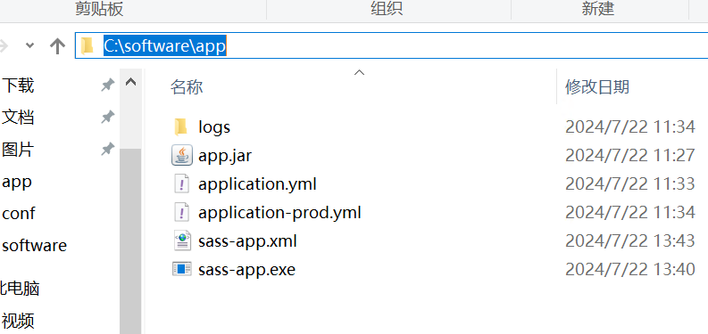

## windows把应用注册成服务

##### 1.下载winsw

> github: https://github.com/winsw/winsw/releases
>
> 把下面两个文件重命名应用名称



##### 2.修改xml 文件

``` xml
<service>
  <id>sass-app</id>
  <name>sass-app</name>
  <description>sass-app服务</description>
  <!-- java环境变量 -->
  <!--<env name="JAVA_HOME" value="%JAVA_HOME%"/>-->
  <!-- 可执行命令 -->
  <executable>java</executable>
  <!-- 执行参数 -->
  <arguments>-Dspring.profiles.active=prod -jar C:\software\app\app.jar</arguments>
  <!-- 开机启动 -->
  <startmode>Automatic</startmode>
  <!-- 服务日志存储位置 -->
  <logpath>C:\software\app\logs</logpath>
</service>
```

##### 3.安装服务

```sh 
sass-app.exe install
```

##### 4.其他服务

```sh
sass-app.exe uninstall  #卸载服务
sass-app.exe start #启动服务
sass-app.exe stop #停⽌服务
sass-app.exe restart #重启服务
sass-app.exe status #输出当前服务的状态
```

