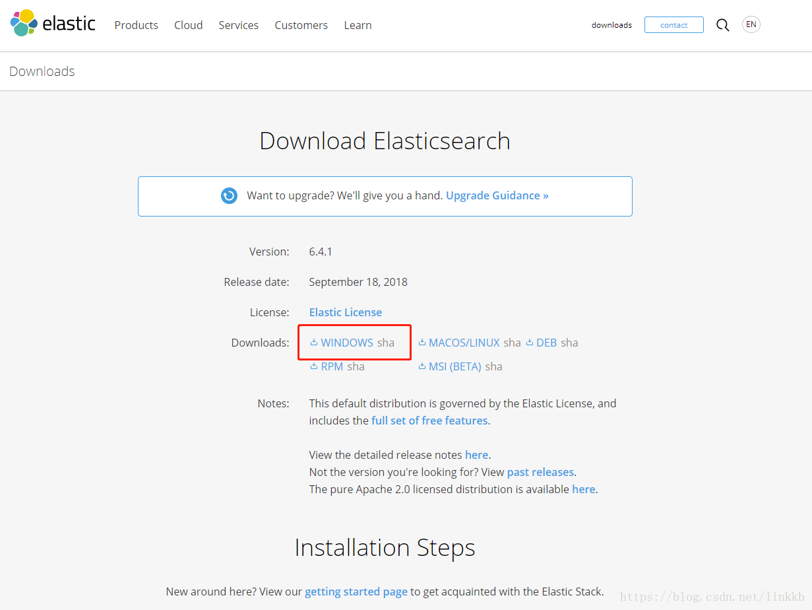
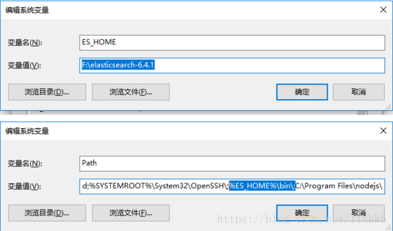
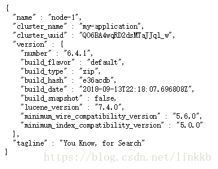

## 安装ElasticSearch

####  1.下载

ElasticSearch官网：https://www.elasticsearch.org

ElasticSearch 下载地址：https://www.elastic.co/downloads/elasticsearch

 

####  2.配置环境变量

 

# 3.测试运行

将下载好的软件解压到目录，依次打开elasticsearch-6.4.1\bin\，然后双击elasticsearch.bat 即可完成ElasticSearch的安装。访问：http://localhost:9200 即可看到是否安装成功。如果显示json串就表示安装成功

