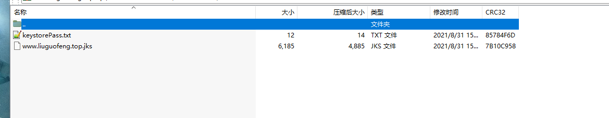

## SpringBoot配置HTTPS

##### 1.在jdk安装目录下的bin目录打开cmd运行

```sh
keytool -genkey -alias tomcat -storetype PKCS12 -keyalg RSA -keysize 2048 -keystore keystore.p12 -validity 3650
```

```sh
keytool -genkey -alias www.liuguofeng.top -storetype PKCS12 -keyalg RSA -keysize 2048 -keystore keystore.p12 -validity 3650
Enter keystore password:
   Re-enter new password:
   What is your first and last name?
   [Unknown]:
   What is the name of your organizational unit?
   [Unknown]:
   What is the name of your organization?
   [Unknown]:
   What is the name of your City or Locality?
   [Unknown]:
   What is the name of your State or Province?
   [Unknown]:
   What is the two-letter country code for this unit?
   [Unknown]:
   Is CN = Unknown, OU=Unknown, O = Unknown, L = Unknown, ST = Unknown, C = Unknown correct?
   [no]: yes
```

> 这段代码将产生一个名为 keystore.p12 的PKCS12 keystore 文件，证书别名为 www.liuguofeng.top 默认

##### 2. SpringBoot内置tomcat服务器，使用tomcat证书



1.  将jks证书文件放到application.propertis配置文件相同的目录中

2. 在application.properties配置文件中添加如下几行配置：

   ```shell
   server.port=443
   server.ssl.key-store =classpath:***.*******.com.jks
   server.ssl.key-store-password=********
   server.ssl.keyStoreType= JKS
   ```

   - 其中port指定了SSL监听的端口，只有访问该端口才会采用https方式。该端口可以随意指定，不会冲突即可。
   - key-store制定了证书文件的完整路径名。注意classpath:标志必不可少哦，否则到服务器上会提示证书文件找不到。
   - key-store-password指定了私钥，即keystorePass.txt中的内容。
   - KeyStoreType指定证书文件的类型，jks证书文件的类型即是JKS。

3. 端口映射(强制跳转https)

   > 在SpringBoot的启动类*Application文件中添加如下

   ```java
   public EmbeddedServletContainerFactory servletContainer() {
   		TomcatEmbeddedServletContainerFactory tomcat = new TomcatEmbeddedServletContainerFactory() {
   			@Override
   			protected void postProcessContext(Context context) {
   				SecurityConstraint securityConstraint = new SecurityConstraint();
   				securityConstraint.setUserConstraint("CONFIDENTIAL");
   				SecurityCollection collection = new SecurityCollection();
   				collection.addPattern("/*");
   				securityConstraint.addCollection(collection);
   				context.addConstraint(securityConstraint);
   			}
   		};
   
   		tomcat.addAdditionalTomcatConnectors(httpConnector());
   		return tomcat;
   	}
   
   	@Bean
   	public Connector httpConnector() {
   		Connector connector = new Connector("org.apache.coyote.http11.Http11NioProtocol");
   		connector.setScheme("http");
   		connector.setPort(8080);   //初始端口
   		connector.setSecure(false);
   		connector.setRedirectPort(443);  //映射端口
   		return connector;
         }
     }
   ```

   

