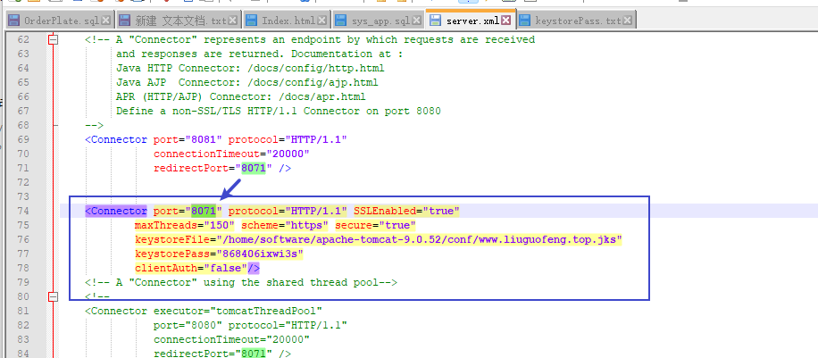

## Tomcat 强制跳转https 配置

#### 1.在conf/server.xml中设置证书和端口

```java
<Connector port="8081" protocol="HTTP/1.1"
               connectionTimeout="20000"
               redirectPort="8071" />
    
	<Connector port="8071" protocol="HTTP/1.1" SSLEnabled="true"
			maxThreads="150" scheme="https" secure="true"
			keystoreFile="/home/software/apache-tomcat-9.0.52/conf/www.liuguofeng.top.jks" 
			keystorePass="868406ixwi3s"
			clientAuth="false"/>
```

#### 2.在conf/web.xml的</web-app> 节点中配置tomcat强制跳转https设置

```java
<login-config>
  <!-- Authorization setting for SSL -->
	<auth-method>CLIENT-CERT</auth-method>
 	<realm-name>Client Cert Users-only Area</realm-name>
</login-config>

<security-constraint>
  <!-- Authorization setting for SSL -->
	<web-resource-collection >
		<web-resource-name >SSL</web-resource-name>
		<url-pattern>/*</url-pattern>
	</web-resource-collection>
	<user-data-constraint>
		<transport-guarantee>CONFIDENTIAL</transport-guarantee>
	</user-data-constraint>
</security-constraint>
```

