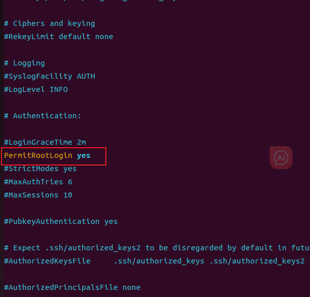

##  Ubuntu使用root连接ssh

1. 设置root密码

   ```sh
   sudo passwd root
   ```

2. 安装`openssh-server`

   ```sh
   sudo apt install openssh-server
   ```

3. 修改配置文件 找到 `PermitRootLogin` 修改成 yes

   ```sh
   sudo vim /etc/ssh/sshd_config
   ```

   

4. 重启服务

   ````sh
   service ssh restart
   ````

   