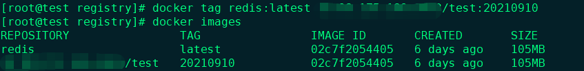
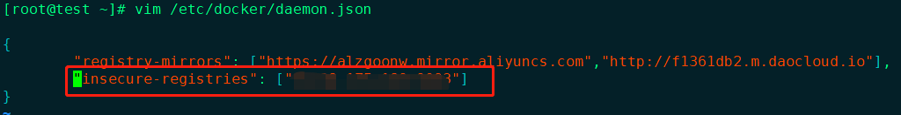
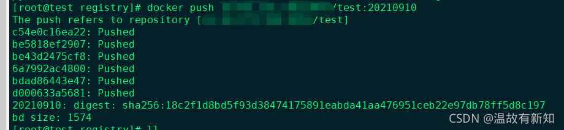

## docker Registry(私有仓库)

1、下载镜像

```sh
docker pull registry
```

2、启动容器

```sh
docker run -d -p 5000:5000 \
-v /var/lib/registry:/var/lib/registry \
--restart=always \
--name registry registry:latest
```

3、浏览器查看

```sh
http://ip_add:5000/v2/
```

### 测试镜像上传

1、`docker tag`一个测试镜像，格式为`registry_url:port/ImageName:tag`

```sh
docker tag redis:latest registry_url:port/ImageName:tag
```


2、配置文件`/etc/docker/daemon.json`修改
**添加"insecure-registries": [“ip:port”]**

重启docker服务

3、`docker push`上传


页面查看 `http://ip_add:5000/v2/_catalog`

4、`docker pull`拉取
远端拉取需要注意也要在配置文件添加"insecure-registries": [“ip:port”]，两个的ip:port一样

