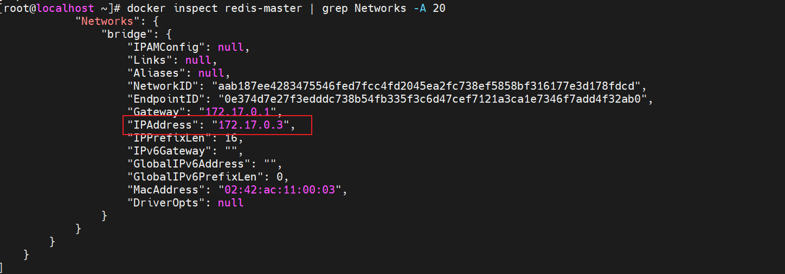

## docker安装redis主从复制

##### 1.简介

> 在主从复制的集群里，主节点一般是一个，从节点一般是两个或多个，写入主节点的数据会被复制到从节点上，这样一旦主节点出现故障，应用系统就能切换到从节点去读写数据，提升系统的可用性。再采用主从复制模式里默认的读写分离机制

##### 2.命令方式搭建主从复制(不推荐)

1. 拉取镜像

   ```shell
   docker pull redis:6.2.7
   ```

2. 启动三个容器

   ```shell
   docker run -d --name redis-master -p 6379:6379 redis:6.2.7 #主节点
   docker run -d --name redis-slave1 -p 6380:6379 redis:6.2.7 #从节点1
   docker run -d --name redis-slave2 -p 6381:6379 redis:6.2.7 #从节点2
   ```

3. 查看 `master`主节点`IPAddress`该容器的IP地址

   ```shell
   docker inspect redis-master | grep Networks -A 20
   ```

   

4. 设置主从复制,进入到 `redis-slave1`和`redis-slave2`容器执行redis-cli:

   ```shell
   127.0.0.1:6379> slaveof 127.0.0.3 6379
   OK
   ```

5. 通过`info replication`命令查看主从配置信息

##### 3.文件配置方式配置主从复制

1. 新建三个redis配置文件

   ```shell
   [root@localhost]# cat redisMaster.conf
   port 6380
   bind 0.0.0.0
   [root@localhost]# cat redisSlave1.conf
   port 6381
   slaveof 127.0.0.1 6380
   [root@localhost]# cat redisSlave2.conf
   port 6382
   slaveof 127.0.0.1 6380
   ```

2. 启动容器

   ```shell
   #主节点容器
   docker run -d --privileged=true --name redis-master -v /opt/redisconf/:/usr/local/etc/redis -p 6380:6380 redis:6.2.7 redis-server /usr/local/etc/redis/redisMaster.conf
   
   #从节点容器1
   docker run -d --privileged=true --name redis-slave1 -v /opt/redisconf/:/usr/local/etc/redis -p 6381:6381 redis:6.2.7 redis-server /usr/local/etc/redis/redisSlave1.conf
   
   #从节点容器2
   docker run -d --privileged=true --name redis-slave2 -v /opt/redisconf/:/usr/local/etc/redis -p 6382:6382 redis:6.2.7 redis-server /usr/local/etc/redis/redisSlave2.conf
   ```

##### 4.配置哨兵模式

1. 新建两个文件

   ```shell
   [root@localhost redisconf]# cat sentinel1.conf
   port 6390
   sentinel monitor master 172.17.0.3 6380 2
   dir "/"
   logfile "sentinel1.log"
   
   [root@localhost redisconf]# cat sentinel2.conf
   port 6391
   sentinel monitor master 172.17.0.3 6380 2
   dir "/"
   logfile "sentinel2.log"
   ```

   - port 6390 :监听的端口
   - sentinel monitor master 172.17.0.3 6380 2 指定监控对象;2表示至少有两个哨兵节点认可,监听节点才失效

2. 运行容器

   ```shell
   #第一个哨兵
   docker run -d --privileged=true --name redis-sentinel1 -v /opt/redisconf/:/usr/local/etc/redis -p 6390:6390 redis:6.2.7 redis-sentinel /usr/local/etc/redis/sentinel1.conf
   
   #第二个哨兵
   docker run -d --privileged=true --name redis-sentinel1 -v /opt/redisconf/:/usr/local/etc/redis -p 6390:6390 redis:6.2.7 redis-sentinel /usr/local/etc/redis/sentinel1.conf
   ```

3. 进入`redis-sentinel1`的redis-cli查看:

   ```shell
   127.0.0.1:6391> info sentinel
   # Sentinel
   sentinel_masters:1
   sentinel_tilt:0
   sentinel_running_scripts:0
   sentinel_scripts_queue_length:0
   sentinel_simulate_failure_flags:0
   master0:name=master,status=ok,address=172.17.0.3:6380,slaves=2,sentinels=2
   ```

   - address=172.17.0.3:6380 :表示现在的主节点所在的ip和端口
   - slaves=2: 表示两个从节点
   - sentinels=2: 表示两个哨兵节点