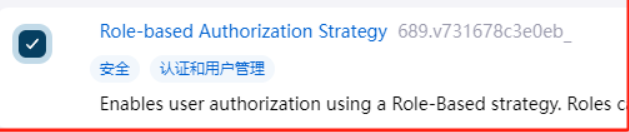
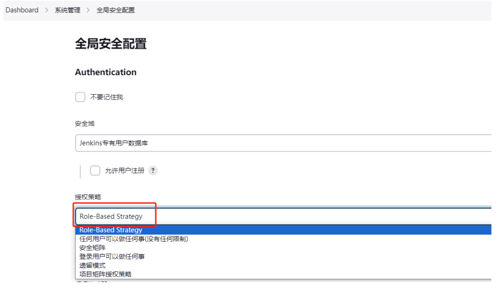
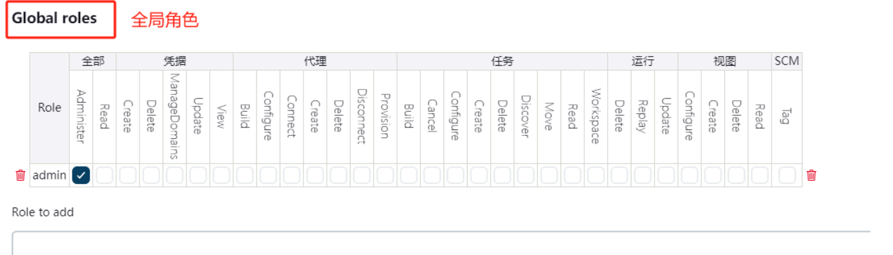
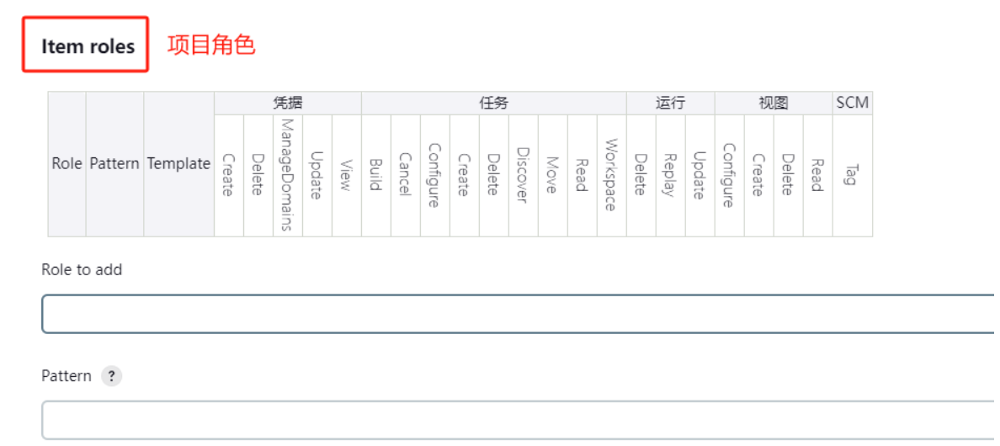
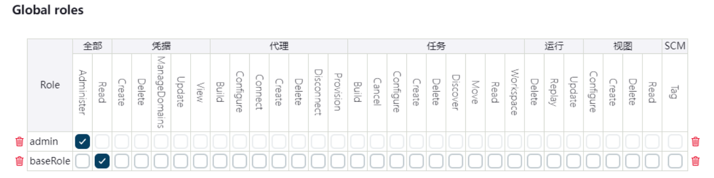
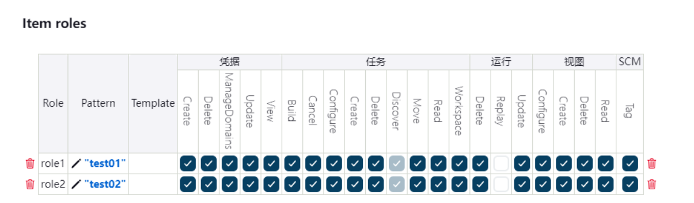
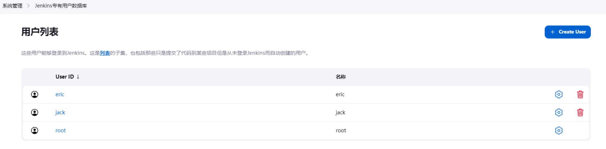
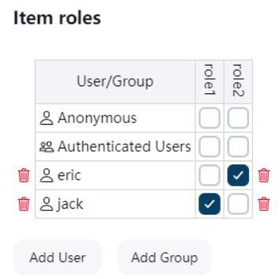

## jenkins插件`Role-based Authorization Strategy`

- 用于jenkins控制用户权限

##### 1.安装插件

##### 2.开启权限全局安全配置

##### 3.创建角色

>在系统管理页面进入 "Manage and Assign Roles"
>点击 "Manage Roles"

Global roles（全局角色）：管理员等高级用户可以创建基于全局的角色
Item roles（项目角色）：针对某个或者某些项目的角色

我们添加以下三个角色：

- baseRole：该角色为全局角色。这个角色需要绑定Overall下面的Read权限，是为了给所有用户绑定最基本的Jenkins访问权限。注意：如果不给后续用户绑定这个角色，会报错误：用户名 ismissing the Overall/Read permission
- role1：该角色为项目角色。 绑定"test01"，意思是只能操作test01的项目。支持正则表达式绑定
- role2：该角色也为项目角色。绑定"test02"，意思是只能操作test02的项目。支持正则表达式绑定

##### 4.创建用户

在系统管理页面进入 "Manage Users/管理用户"--->点击 创建用户
分别创建两个用户：jack和eric

##### 5.给用户分配角色

系统管理页面进入"Manage and Assign Roles"，点击 "Assign Roles"
绑定规则如下：
eric用户分别绑定baseRole和role1角色
jack用户分别绑定baseRole和role2角色

##### 6.创建项目测试权限

以root管理员账户创建两个项目，分别为test01和test02
结果为：
eric用户登录，只能看到test01项目
jack用户登录，只能看到test02项目