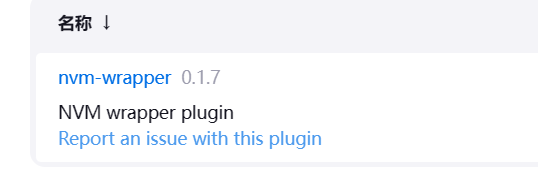
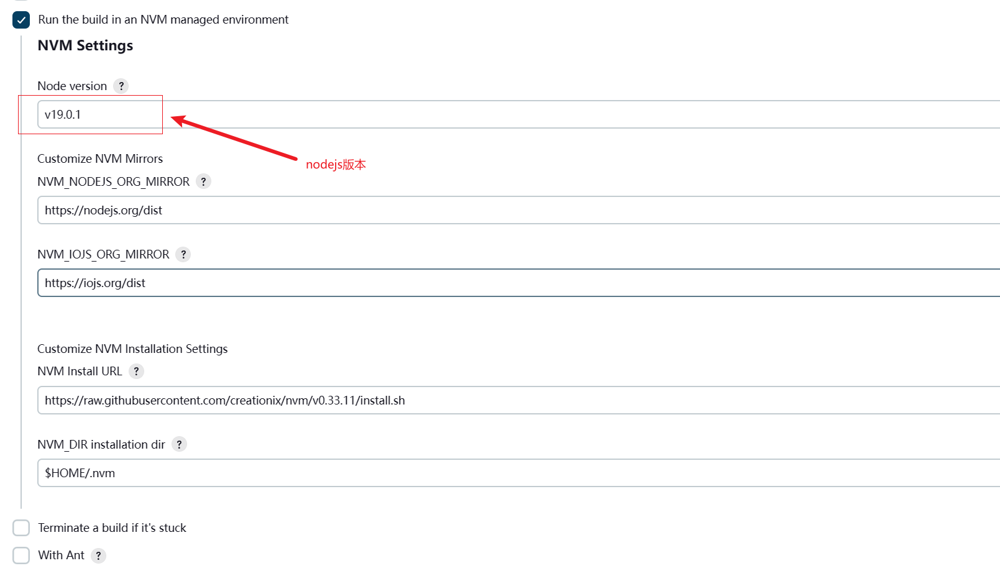

## jenkins插件`nvm-wrapper`

- `nvm-wrapper`可以切换`nodejs`版本

##### 1.安装插件

> 系统管理 > 插件管理 > 可选插件,搜索`nvm-wrapper`并安装



##### 2.配置nvm-wrapper

> 系统管理 > 系统配置 > 找到`nvm-wrapper`标签下的`新增`



##### 3.如果是流水线项目直接安装nvm

```sh
curl -o- https://raw.githubusercontent.com/nvm-sh/nvm/v0.38.0/install.sh | bash
#或者，您可以使用以下命令从GitHub克隆nvm存储库并安装：
git clone https://github.com/nvm-sh/nvm.git ~/.nvm
cd ~/.nvm
git checkout v0.38.0
. nvm.sh
```

```groovy
pipeline {
    agent any

    stages {
        stage('拉取代码') {
            steps {
                checkout scmGit(branches: [[name: '*/master']], extensions: [], userRemoteConfigs: [[credentialsId: 'a71f61a0-1f08-4454-8132-6eb47c0f6bdf', url: 'https://gitee.com/liu_guo_feng/jenkins-pig-ui.git']])
            }
        }
        stage('node版本') {
            steps {
                sh """
                cd ~/.nvm
                git checkout v0.38.0
                . nvm.sh
                nvm install 20.11.1
                nvm use 20.11.1

                node -v 
                npm -v 
                """
            }
        }
    }
}
```

