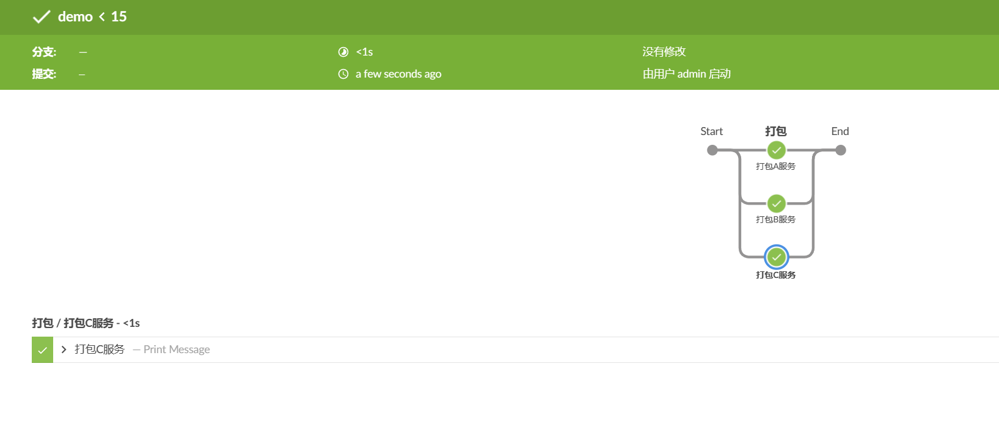
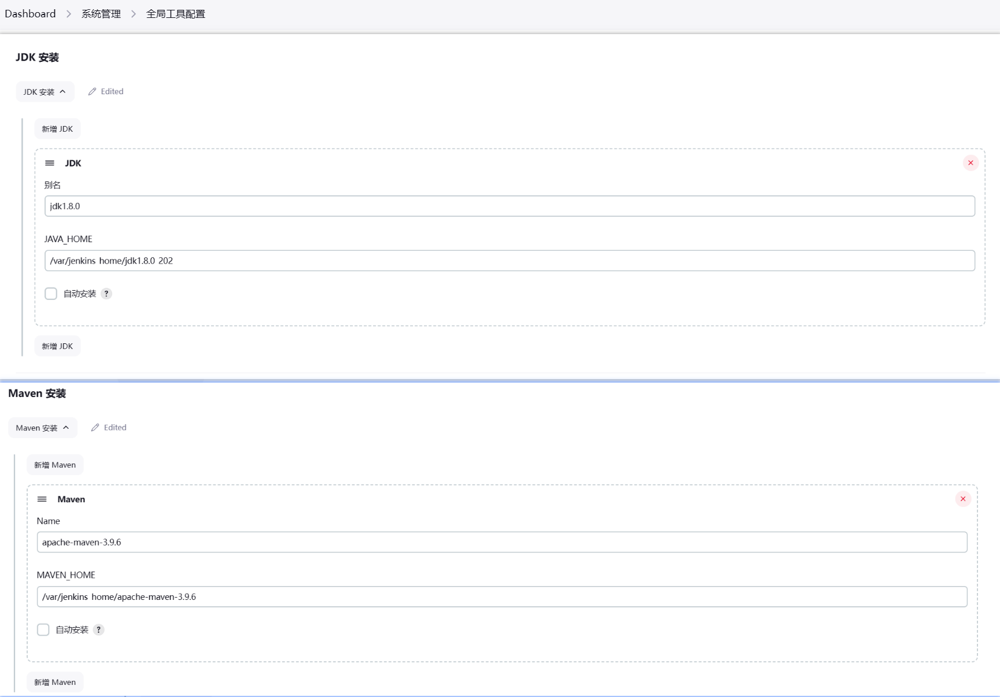
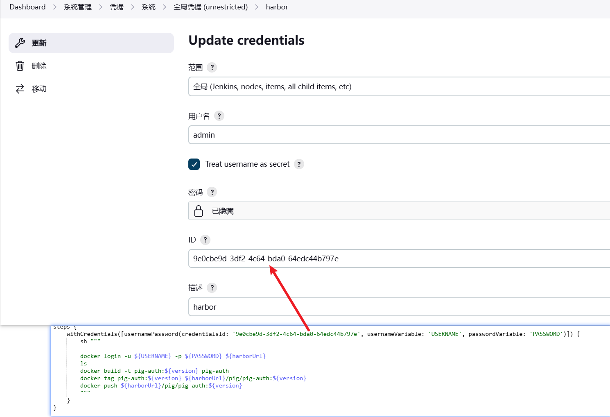

## jenkins的pipeline构建

##### 1.使用环境变量

> Jenkins 流水线通过全局变量 `env` 提供环境变量，它在 `Jenkinsfile` 文件的任何地方都可以使用。Jenkins 流水线中可访问的完整的环境变量列表记录在 ``${YOUR_JENKINS_URL}/pipeline-syntax/globals#env``，并且包括：

- `BUILD_ID` 当前构建的 ID，与 Jenkins 版本 1.597+ 中创建的构建号 BUILD_NUMBER 是完全相同的。
- `BUILD_NUMBER`当前构建号，比如 “153”。
- `BUILD_TAG`字符串 `jenkins-${JOB_NAME}-${BUILD_NUMBER}`。可以放到源代码、jar 等文件中便于识别。
- `BUILD_URL`可以定位此次构建结果的 URL（比如 http://buildserver/jenkins/job/MyJobName/17/ ）
- `EXECUTOR_NUMBER`用于识别执行当前构建的执行者的唯一编号（在同一台机器的所有执行者中）。这个就是你在“构建执行状态”中看到的编号，只不过编号从 0 开始，而不是 1。
- `JAVA_HOME`如果你的任务配置了使用特定的一个 JDK，那么这个变量就被设置为此 JDK 的 JAVA_HOME。当设置了此变量时，PATH 也将包括 JAVA_HOME 的 bin 子目录。
- `JENKINS_URL`Jenkins 服务器的完整 URL，比如 https://example.com:port/jenkins/ （注意：只有在“系统设置”中设置了 Jenkins URL 才可用）。
- `JOB_NAME`本次构建的项目名称，如 “foo” 或 “foo/bar”。
- `NODE_NAME`运行本次构建的节点名称。对于 master 节点则为 “master”。
- `WORKSPACE`workspace 的绝对路径。

```groovy
pipeline {
    agent any
    stages {
        stage('Example') {
            steps {
                  echo """
                    BUILD_ID=${env.BUILD_ID},
                    BUILD_NUMBER=${env.BUILD_NUMBER},
                    BUILD_TAG=${env.BUILD_TAG},
                    BUILD_URL=${env.BUILD_URL},
                    EXECUTOR_NUMBER=${env.EXECUTOR_NUMBER},
                    JAVA_HOME=${env.JAVA_HOME},
                    JENKINS_URL=${env.JENKINS_URL},
                    JOB_NAME=${env.JOB_NAME},
                    NODE_NAME=${env.NODE_NAME},
                    WORKSPACE=${env.WORKSPACE}
                    """
            }
        }
    }
}

// 结果
//BUILD_ID=8,
//BUILD_NUMBER=8,
//BUILD_TAG=jenkins-jenkins-pig-8,
//BUILD_URL=http://192.168.1.118:8080/job/jenkins-pig/8/,
//EXECUTOR_NUMBER=1,
//JAVA_HOME=/opt/java/openjdk,
//JENKINS_URL=http://192.168.1.118:8080/,
//JOB_NAME=jenkins-pig,
//NODE_NAME=built-in,
//WORKSPACE=/var/jenkins_home/workspace/jenkins-pig
```

```groovy
pipeline {
    agent any

    environment { 
        author = 'liuguofeng'   
    }

    stages {
        stage('Hello') {
            steps {
                echo """ 
                author=${author}
                """
            }
        }
    }
}

// 结果
// author=liuguofeng
```

##### 2.并行执行

> 流水线有一个内置的并行执行部分脚本式流水线的功能，可以并行构建应用提高打包速度

```groovy
pipeline {
    agent any

    stages {
        stage('打包') {
            parallel {
                
                stage('打包A服务') {
                    steps {
                        echo '打包A服务'
                    }
                }
                stage('打包B服务') {
                    steps {
                        echo '打包B服务'
                    }
                }
                stage('打包C服务') {
                    steps {
                        echo '打包C服务'
                    }
                }
                
            }
        }
    }
}

```


##### 3.流水线指定编译版本

> 在 `系统管理 > 全局工具配置`配置的jdk版本、maven版本等,可以在`tools`中指定配置的版本



```groovy
pipeline {
    agent any

    tools {
        maven 'apache-maven-3.9.6'
        jdk 'jdk1.8.0'
    }

    stages {
        stage('Hello') {
            steps {
                sh """ 
                java -version
                mvn -version
                JAVA_HOME=${env.JAVA_HOME}
                """
            }
        }
    }
}

// 结果
//+ java -version
//java version "1.8.0_202"
//Java(TM) SE Runtime Environment (build 1.8.0_202-b08)
//Java HotSpot(TM) 64-Bit Server VM (build 25.202-b08, mixed mode)
//+ mvn -version
//Apache Maven 3.9.6 (bc0240f3c744dd6b6ec2920b3cd08dcc295161ae)
//Maven home: /var/jenkins_home/apache-maven-3.9.6
//Java version: 1.8.0_202, vendor: Oracle Corporation, runtime: /var/jenkins_home/jdk1.8.0_202/jre
//Default locale: en_US, platform encoding: ANSI_X3.4-1968
//OS name: "linux", version: "5.15.0-102-generic", arch: "amd64", family: "unix"
//+ JAVA_HOME=/var/jenkins_home/jdk1.8.0_202
```

##### 4.流水线中withCredentials 使用凭证

> 用于安全地处理凭证。在Jenkins管道脚本中，可能需要连接到其他系统，比如Git服务器、Docker Registries、AWS等，这些系统可能需要身份验证凭证。



```groovy
pipeline {
    agent any

    stages {
        stage('withCredentials 使用凭证') {
            steps {
                withCredentials([usernamePassword(credentialsId: '9e0cbe9d-3df2-4c64-bda0-64edc44b797e', usernameVariable: 'USERNAME', passwordVariable: 'PASSWORD')]) {
                    echo """
                    USERNAME=${USERNAME}
                    PASSWORD=${PASSWORD}
                    """
                }
            }
        }
    }
}

// 结果
// Warning: A secret was passed to "echo" using Groovy String interpolation, which is insecure.
//		 Affected argument(s) used the following variable(s): [PASSWORD, USERNAME]
//		 See https://jenkins.io/redirect/groovy-string-interpolation for details.
//                    USERNAME=****
//                    PASSWORD=****
```


