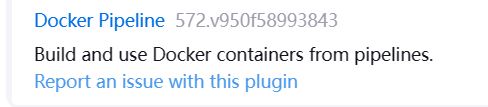

## jenkins调用docker构建

##### 1.安装插件



##### 2.使用node:16打包前端项目

```groovy
pipeline {
    agent any  
    stages {
        stage('拉取代码') {
            steps {
                checkout scmGit(branches: [[name: '*/master']], extensions: [], userRemoteConfigs: [[credentialsId: 'a71f61a0-1f08-4454-8132-6eb47c0f6bdf', url: 'https://gitee.com/liu_guo_feng/jenkins-pig-ui.git']])
            }
        }
        stage('node版本') {
            agent {
                docker { 
                    image 'node:16'
                    args """-v /home/jenkins/data/workspace/pig-jenkins-ui:/home/project"""
                }
            }
            steps {
                sh """
                node -v 
                npm -v
                cd /home/project
                ls -lh
                
                npm install --registry=https://registry.npmmirror.com/
                npm run build:docker
                """
            }
        }
    }
}

```

1. `agent`: 这是一个指令，用于指定执行此 Pipeline 的代理。Jenkins 支持多种代理类型，如 `docker`、`kubernetes` 等。
2. `docker`: 这是指定代理类型为 Docker 的子指令。Jenkins 会尝试在 Docker 容器中执行此 Pipeline。
3. `image 'node:16'`: 这是指定要使用的 Docker 镜像。在这个例子中，Jenkins 将使用带有 Node.js v16 的官方 Node.js Docker 镜像。这意味着您的构建将在具有 Node.js v16 的环境中执行。
4. `args """-v /home/jenkins/data/workspace/pig-jenkins-ui:/home/project"""`: 这是传递给 Docker 容器的参数。`-v` 参数用于挂载 Docker 宿主机上的目录到容器内部。具体来说，它将宿主机上的 `/home/jenkins/data/workspace/pig-jenkins-ui` 目录挂载到容器内的 `/home` 目录。这样，容器内的应用可以访问这个目录，并且任何对容器内 `/home/project` 目录的更改都会反映到宿主机上的对应目录。

##### 3.maven打包java项目

```groovy
pipeline {
    agent any
    stages {
        
        stage('拉取代码') {
            steps {
               checkout scmGit(branches: [[name: '*/master']], extensions: [], userRemoteConfigs: [[credentialsId: '35151e91-5185-4519-be13-ddbb098934ad', url: 'https://gitee.com/liu_guo_feng/jenkins-pig.git']])
                echo '拉取代码结束'
            }
        }
        
        stage('编译') {
            agent {
                docker { 
                    image 'maven:3.6.3-jdk-8'
                    args """-v /home/jenkins/data/workspace/pig:/home/project -v /home/maven/conf/settings-docker.xml:/usr/share/maven/ref/settings-docker.xml -v /home/maven/repository:/usr/share/maven/ref/repository"""
                }
            }
            steps {
                sh """
                java -version 
                mvn -version
                cd /home/project
                ls -lh
                
                cat /usr/share/maven/ref/settings-docker.xml
                
                mvn clean
                mvn -DskipTests=true package -P prod --settings /usr/share/maven/ref/settings-docker.xml
                """
            }
        }
    }
}

```

**对应的`/home/maven/conf/settings-docker.xml:/usr/share/maven/ref/settings-docker.xml`**

```xml
<?xml version="1.0" encoding="UTF-8"?>
<settings xmlns="http://maven.apache.org/SETTINGS/1.0.0"
          xmlns:xsi="http://www.w3.org/2001/XMLSchema-instance"
          xsi:schemaLocation="http://maven.apache.org/SETTINGS/1.0.0 http://maven.apache.org/xsd/settings-1.0.0.xsd">

<localRepository>/usr/share/maven/ref/repository</localRepository>

  <mirrors>

		<mirror>  
		  <id>alimaven</id>  
		  <name>aliyun maven</name>  
		  <url>http://maven.aliyun.com/nexus/content/groups/public/</url>  
		  <mirrorOf>central</mirrorOf>          
		</mirror> 
  </mirrors>

  
  <profiles>
	  <profile>   
			<id>jdk1.8</id>
			<activation>   
				<activeByDefault>true</activeByDefault>
				<jdk>1.8</jdk>   
			</activation>
			<properties>   
				<maven.compiler.source>1.8</maven.compiler.source>
				<maven.compiler.target>1.8</maven.compiler.target>
				<maven.compiler.compilerVersion>1.8</maven.compiler.compilerVersion>
				<encoding>UTF-8</encoding>
			</properties>   
		</profile>
    
  </profiles>

</settings>


```

