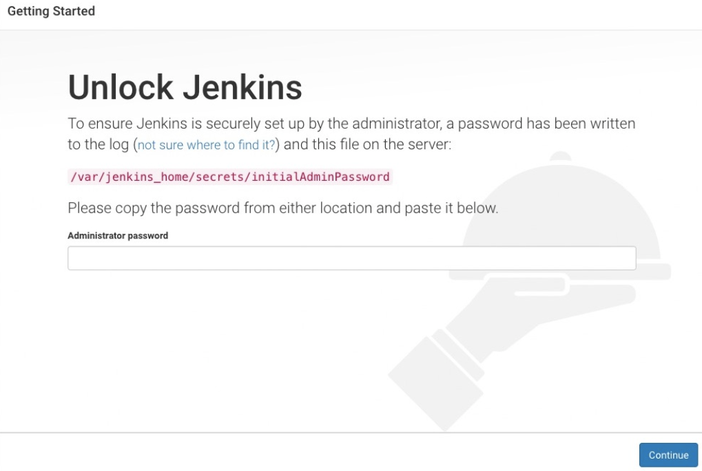
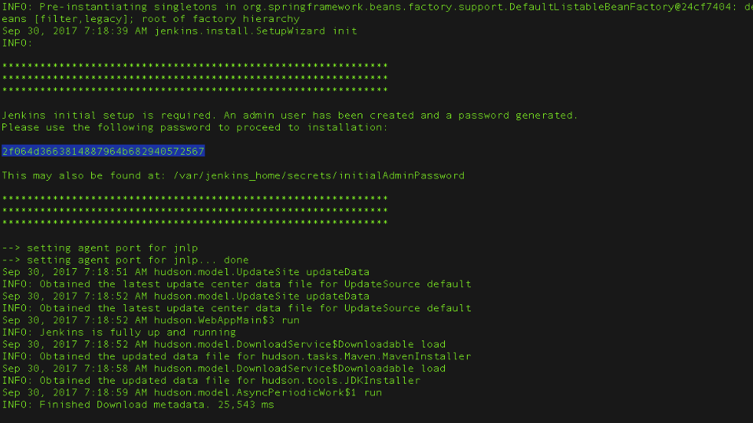
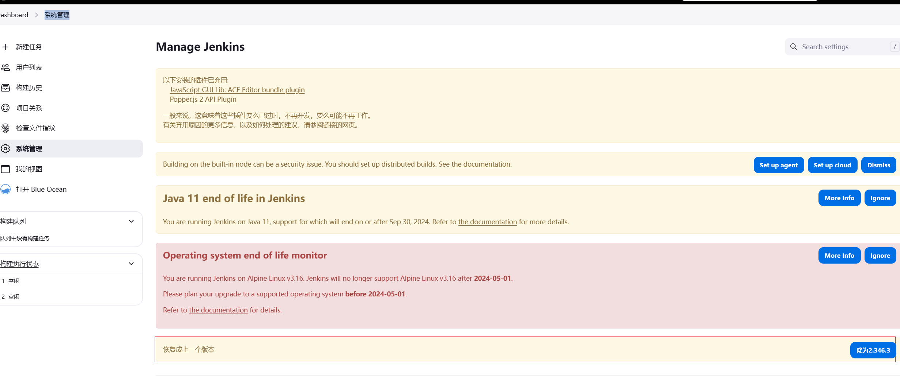
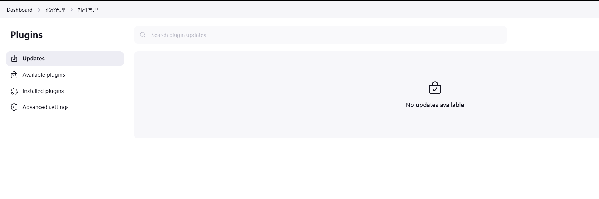

## 安装jenkins

> 官方文档地址

##### 1.下载 `jenkinsci/blueocean` 镜像并使用以下docker run 命令将其作为Docker中的容器运行 ：

```sh
docker run \
  -u root \
  -d \ 
  -p 8080:8080 \ 
  -p 50000:50000 \ 
  -v jenkins-data:/var/jenkins_home \ 
  -v /var/run/docker.sock:/var/run/docker.sock \ 
  jenkinsci/blueocean 
```

##### 2.设置容器开机启动

```sh
docker update  jenkinsci/blueocean --restart=always
```

##### 3.通过Docker日志访问Jenkins控制台日志查看密码





##### 4.自定义jenkins插件

- **安装建议的插件** - 安装推荐的一组插件，这些插件基于最常见的用例.
- **选择要安装的插件** - 选择安装的插件集。当你第一次访问插件选择页面时，默认选择建议的插件。

**建议使用`选择要安装的插件`然后全部不选择，进入后再安装**

##### 5.创建第一个管理员用户

Jenkins要求您创建第一个管理员用户。 . 出现“ **创建第一个管理员用户** ”页面时， 请在各个字段中指定管理员用户的详细信息，然后单击 **保存完成** 。 . 当 **Jenkins准备好了** 出现时，单击*开始使用 Jenkins*。

##### 6.更新插件到最新

- **系统管理** 升级最新版本
- **系统管理** > **插件管理** 全部升级最新版本，否则会出现兼容问题（铁的教训）




