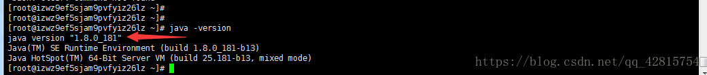

## liunx安装jdk

### 一.yum一键安装(缺点:只能安装openJdk)

##### 1. 首先执行以下命令查看可安装的jdk版本：

   ```shell
   yum -y list java*
   ```

##### 2. 选择自己需要的jdk版本进行安装，比如这里安装1.8，执行以下命令：

   ```shell
   yum install -y java-1.8.0-openjdk-devel.x86_64
   ```

##### 3. 安装完成之后，查看安装的jdk版本，输入以下指令：

   ```shell
   java -version
   ```
### 二.手动安装

##### 1. 去Oracle官网下载需要安装的jdk版本

   > 如果下载失败:
   >
   > 1、编程宝库 java jdk镜像
   >
   > http://www.codebaoku.com/jdk/jdk-index.html
   >
   > 2、华为java-jdk镜像
   >
   > https://repo.huaweicloud.com/java/jdk/

##### 2. 将该压缩包放到/usr/local/jdk目录下，jdk目录需要自己手动创建，也可以叫java，名字自己随意取（见名知意），然后解压该压缩包，输入如下指令：

   ```shell
   tar zxvf jdk-8u181-linux-x64.tar.gz
   ```

##### 3. 接下来就该配置环境变量了，输入以下指令进行配置：

   ```she
   vim /etc/profile
   ```

##### 4. 输入完毕并回车，在文件尾部添加如下信息：

   ```shell
   export JAVA_HOME=/usr/local/jdk/jdk1.8.0_181
   export CLASSPATH=$:CLASSPATH:$JAVA_HOME/lib/
   export PATH=$PATH:$JAVA_HOME/bin
   ```

##### 5. 编辑完之后，保存并退出，然后输入以下指令，刷新环境配置使其生效：

   ```shell
   source /etc/profile
   ```

##### 6. 查看jdk是否安装成功，输入指令java -version即可。

   


