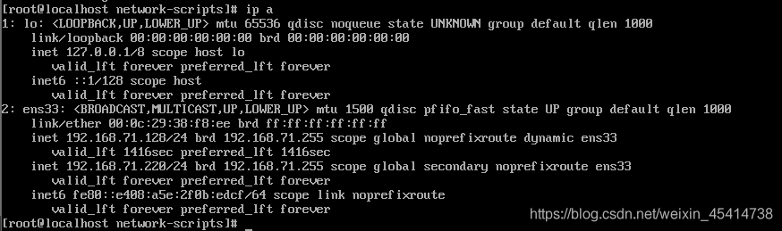

## CentOS 7修改固定IP地

> 有时需要远程连接liunx,这时就需要把系统更改为固定IP了

1. 直接编辑网卡文件

```shell
vi /etc/sysconfig/network-scripts/ifcfg-ens33
```

2. 在文件中添加这几行，如果有就修改

```shell
ONBOOT=yes
IPADDR=192.168.1.201
NETMASK=255.255.255.0
GATEWAY=192.168.1.1
DNS1=114.114.114.114
```

3. 重启网络服务

```shell
service network restart
```



使用 ip a命令查看是否更改成功

这样你就可以使用远程连接工具连接了


