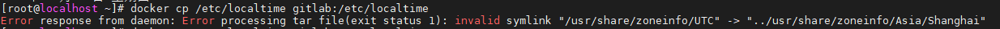
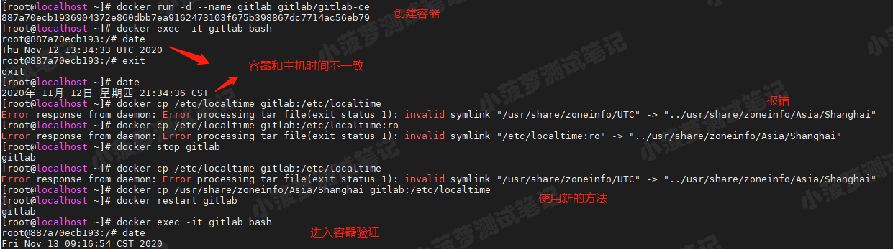

## Docker - 时区问题

> Docker - 解决同步容器与主机时间报错：Error response from daemon: Error processing tar file(exit status 1): invalid..



解决方案

```shell
docker cp /usr/share/zoneinfo/Asia/Shanghai gitlab:/etc/localtime
```


重启容器

```shell
docker restart gitlab
```


进入容器进行验证

```shell
docker exec -it gitlab bash
```




