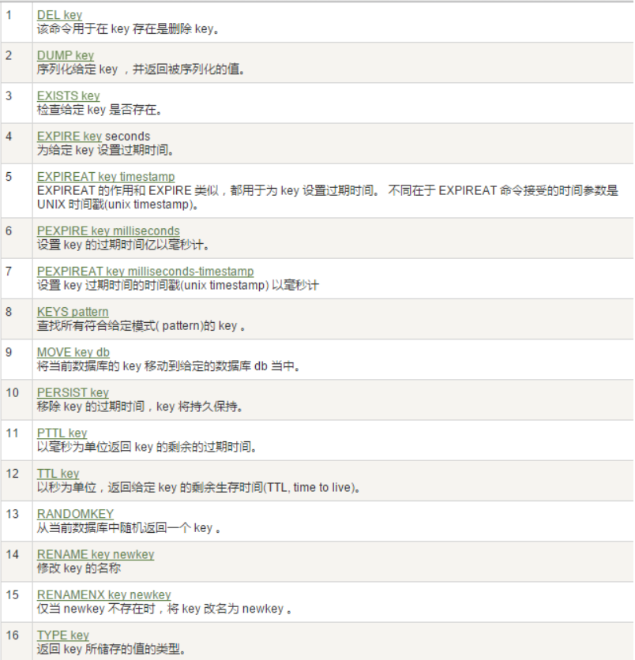
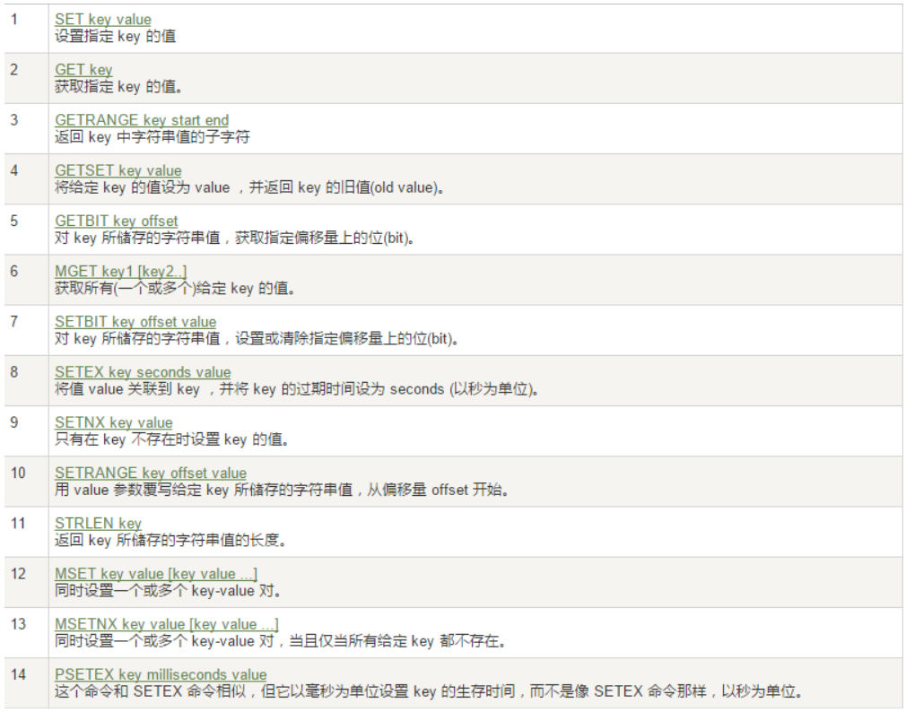

## docker安装redis

加载镜像

查询官方镜像及其版本信息

```shell
$ docker search redis
```

加载最新镜像

```shell
$ docker pull redis:lastest
```

查看本地镜像

```shell
$ docker images
```

REPOSITORY          TAG                 IMAGE ID            CREATED             SIZE
docker.io/redis     latest              f0453552d7f2        7 days ago          98.2 MB
docker.io/mysql     latest              9b51d9275906        2 weeks ago         547 MB
docker.io/tomcat    latest              4e7840b49fad        3 weeks ago         529 MB


运行容器

启用daemon

```shell
$ docker run --name kris-redis -p 6379:6379 -d redis --requirepass "123456"
```

自定义redis.conf启动

docker run -p 6379:6379 --name kris-redis -v /root/docker/redis/redis.conf:/etc/redis/redis.conf  -v /root/docker/redis/data:/data -d redis redis-server /etc/redis/redis.conf --appendonly yes


```shell
# -p 6379:6379:把容器内的6379端口映射到宿主机6379端口
# -v /root/docker/redis/redis.conf:/etc/redis/redis.conf：把宿主机配置好的redis.conf放到容器内的这个位置中
# -v /root/docker/redis/data:/data：把redis持久化的数据在宿主机内显示，做数据备份
# redis-server /etc/redis/redis.conf：这个是关键配置，让redis不是无配置启动，而是按照这个redis.conf的配置启动
# -appendonly yes：redis启动后数据持久化
```

查看运行状态

```shell
$ docker ps -a
CONTAINER ID        IMAGE               COMMAND                  CREATED             STATUS              PORTS                               NAMES
3c90175b38e6        redis               "docker-entrypoint..."   13 minutes ago      Up 13 minutes       0.0.0.0:6380->6379/tcp              kris-redis
2bbd52391bab        mysql               "docker-entrypoint..."   7 days ago          Up 7 days           0.0.0.0:3306->3306/tcp, 33060/tcp   kris-mysql
```

启用redis-cli，即redis客户端

```shell
$ docker exec -it kris-redis redis-cli
```

Redis五大数据类型

前言

Redis的关键字对大小写不敏感，但不可以混合使用大小写。

Redis存储的形式是键值对。

Redis的五大数据类型：字符串、列表、集合、哈希、有序集合

Redis键

常用：



案例：

keys * ：返回所有"顶层key"，即各大数据类型所存储数据的名称（注：Hash也是一个键值对，但Value也是一个键值对，<KEY, <K, V>>），举个栗子：

127.0.0.1:6379>$ keys *

1) "customer"  # 定义的Hash
2) "set01"  # 定义的Set
3) "list01"  # 定义的List
4) "username"  # 定义的String


exists ：判断某个key是否存在

127.0.0.1:6379>$ exists username
(integer) 1  # 存在返回1
127.0.0.1:6379>$ exists username00
(integer) 0  # 不存在返回0


move key dbindex ：当前库（索引为：0）就没有了，被移除了，数据被迁移到其他数据库

注：redis.conf中默认有16个库，默认为0，初始库0是这样的127.0.0.1:6379>，当选择其他库库时，是这样的127.0.0.1:6379[dbindex]> dbindex表示库的索引。

127.0.0.1:6379>$ move username 2  # 数据迁移至其他库
(integer) 1  # 迁移成功
127.0.0.1:6379>$ select 2  # 选择当前操作的数据库
OK
127.0.0.1:6379[2]>$ get username  # 查询迁移后的数据，若查询1库中数据，需要重新选择库
"kris"


expire key 秒钟 ：为给定的key设置过期时间

ttl key ：查看还有多少秒过期，-1表示永不过期，-2表示已过期

127.0.0.1:6379[2]>$ expire username 10  # 存活10秒
127.0.0.1:6379[2]>$ ttl username
(integer) 7
127.0.0.1:6379[2]>$ ttl username
(integer) 2
127.0.0.1:6379[2]>$ ttl username
(integer) -2 # 已过期
127.0.0.1:6379[2]>$ get username
(nil)  # 已经不存在了


type key ：查看你的key是什么类型

127.0.0.1:6379>$ type list01
list


字符串

概要：

- 字符串类型是redis最基础的数据结构，首先键是字符串类型，而且其他几种结构都是在字符串类型基础上构建的，字符串类型是其他四种数据结构的基础类型。

- 字符串类型实际上可以是字符串（简单的字符串、复杂的字符串（xml、json）、数字（整数、浮点数）、二进制（图片、音频、视频）），但最大不能超过512M。

使用场景：

- 缓存功能：字符串最经典的使用场景，redis作为缓存层，Mysql作为储存层，绝大部分请求数据都是redis中获取，由于redis具有支撑高并发特性，所以缓存通常能起到加速读写和降低后端压力的作用。redis为何具备支撑高并发的特性？ 。

- 计数器：许多运用都会使用redis作为计数的基础工具，他可以实现快速计数、查询缓存的功能，同时数据可以一步落地到其他的数据源。如：视频播放数系统就是使用redis作为视频播放数计数的基础组件。

- 共享session：出于负载均衡的考虑，分布式服务会将用户信息的访问均衡到不同服务器上，用户刷新一次访问可能会需要重新登录，为避免这个问题可以用redis将用户session集中管理，在这种模式下只要保证redis的高可用和扩展性的，每次获取用户更新或查询登录信息都直接从redis中集中获取。

- 限速：处于安全考虑，每次进行登录时让用户输入手机验证码，为了短信接口不被频繁访问，会限制用户每分钟获取验证码的频率。

常用命令：



案例：

set/get/del/append/strlen 定义时，如果已经存在，则会覆盖保存

127.0.0.1:6379>$ set username kris
OK
127.0.0.1:6379>$ get username
"kris"
127.0.0.1:6379>$ append username louis
(integer) 9
127.0.0.1:6379>$ get username
"krislouis"
127.0.0.1:6379>$ strlen username
(integer) 9


列表

概要：

- 列表类型是用来储存多个有序的字符串，列表中的每个字符串成为元素（element）,一个列表最多可以储存$2^{32}-1$个元素，在redis中，可以队列表两端插入（pubsh）和弹出（pop），还可以获取指定范围的元素 列表、获取指定索引下表的元素等，列表是一种比较灵活的数据结构，它可以充当栈和队列的角色，在实际开发中有很多应用场景。

- 优点：

1.列表的元素是有序的，这就意味着可以通过索引下标获取某个或某个范围内的元素列表。

2.列表内的元素是可以重复的。

使用场景：

- 消息队列： redis的lpush+brpop命令组合即可实现阻塞队列，生产者客户端是用lupsh从列表左侧插入元素，多个消费者客户端使用brpop命令阻塞时的“抢”列表尾部的元素，多个客户端保证了消费的负载均衡和高可用性。

- 使用列表技巧：

lpush+lpop=Stack(栈)
lpush+rpop=Queue（队列）
lpush+ltrim=Capped Collection（有限集合）
lpush+brpop=Message Queue（消息队列）


常用： 待更新

案例： 待更新

哈希

概要：

- 在redis中哈希类型是指键本身又是一种键值对结构，如 :

value={{field1,value1},......{fieldN,valueN}}


使用场景：

- 特性：哈希结构相对于字符串序列化缓存信息更加直观，并且在更新操作上更加便捷。

- 常用于用户信息等管理。

- 不足：哈希类型和关系型数据库有所不同，哈希类型是稀疏的，而关系型数据库是完全结构化的，易于实现复杂的关系查询，redis是非关系型数据库，需要模拟关系型数据库进行复杂查询，开发困难，维护成本高。

常用： 待更新

案例： 待更新

集合

概要：

- 集合类型也是用来保存多个字符串的元素，但和列表不同的是集合中不允许有重复的元素，并且集合中的元素是无序的，不能通过索引下标获取元素，redis除了支持集合内的增删改查，同时还支持多个集合取交集、并集、差集，并合理的使用好集合类型，能在实际开发中解决很多实际问题。

使用场景：

- 标签（tag）：集合类型比较典型的使用场景，如一个用户对娱乐、体育比较感兴趣，另一个可能对新闻感兴趣，这些兴趣就是标签，有了这些数据就可以得到同一标签的人，以及用户的共同爱好的标签，这些数据对于用户体验以及曾强用户粘度比较重要。（用户和标签的关系维护应该放在一个事物内执行，防止部分命令失败造成数据不一致）

sadd=tagging（标签）

spop/srandmember=random item（生成随机数，比如抽奖）

sadd+sinter=social Graph(社交需求)

常用： 待更新

案例： 待更新

有序集合

概要：

- 有序集合和集合有着必然的联系，他保留了集合不能有重复成员的特性，但不同得是，有序集合中的元素是可以排序的，但是它和列表的使用索引下标作为排序依据不同的是，它给每个元素设置一个分数，作为排序的依据。（有序集合中的元素不可以重复，但是csore可以重复，就和一个班里的同学学号不能重复，但考试成绩可以相同）。

列表、集合、有序集合三者的异同点

使用场景：

排行榜：有序集合经典使用场景。

例如视频网站需要对用户上传的视频做排行榜，榜单维护可能是多方面：按照时间、按照播放量、按照获得的赞数等。