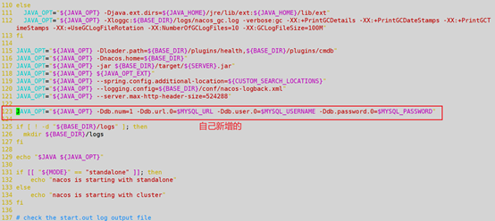

## docker通过Dockerfile部署单机版nacos


1. 下载并解压

```shell
#下载
wget https://github.com/alibaba/nacos/releases/download/1.4.3/nacos-server-1.4.3.tar.gz
#解压
tar -zxvf nacos-server-1.4.3.tar.gz
```


2. 修改bin/startup.sh文件

```shell
# 第55行  export MODE="cluster"  改为 standalone
export MODE="standalone"

#第123行 新增 mysql 配置
JAVA_OPT="${JAVA_OPT} -Dspring.datasource.platform=mysql -Ddb.num=1 -Ddb.url.0=$MYSQL_URL -Ddb.user.0=$MYSQL_USERNAME -Ddb.password.0=$MYSQL_PASSWORD"
```




3. 编写Dockerfile构建

在nacos的上级目录创建Dockerfile文件：

```csharp
FROM java:8

#指定工种目录
WORKDIR /nacos

#拷贝文件
COPY ./nacos $WORKDIR/nacos

#检查是否拷贝成功
RUN sh -c 'ls $WORKDIR/nacos'

#设置环境变量
ENV JAVA_OPTS=$JAVA_OPTS

#设置mysql 环境变量 在启动springBoot时可直接使用如：-Dserver.port=$PORT
ENV MYSQL_URL=$MYSQL_URL
ENV MYSQL_USERNAME=$MYSQL_USERNAME
ENV MYSQL_PASSWORD=$MYSQL_PASSWORD

#运行 nacos是通过 startup.sh 允许的 如果是普通的jar包我们可以替换为 ["nohup","java","-jar","-Dserver.port=${port} -Dspring.profiles.active=${spring_env} /data/app.jar","&"]
ENTRYPOINT [ "sh", "-c", "$WORKDIR/nacos/bin/startup.sh && tail -f $WORKDIR/nacos/logs/start.out" ]
```

构建

```csharp
docker build -t nacos:v1 .
```

4. 启动

```csharp
 docekr run -d -p8848:8848 --name nacos  -e JAVA_OPTS="-Xmx128m -Xss512k" -e MYSQL_URL="jdbc:mysql://192.168.43.206:3306/nacos?characterEncoding=utf8&connectTimeout=1000&socketTimeout=3000&autoReconnect=true&useUnicode=true&useSSL=false&serverTimezone=UTC" -e MYSQL_USERNAME="root" -e MYSQL_PASSWORD="root" nacos:v1
```

