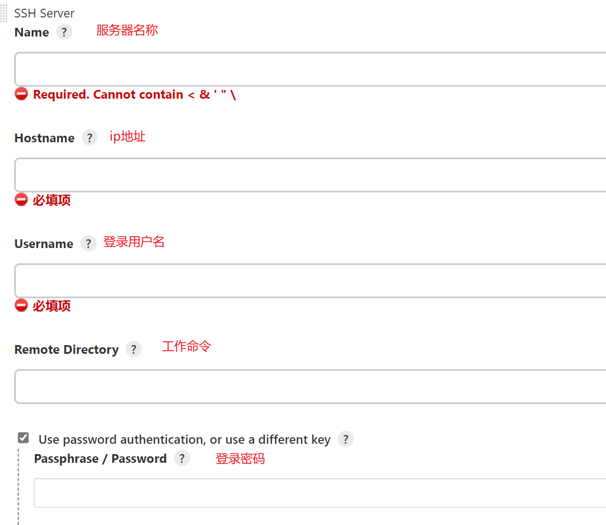
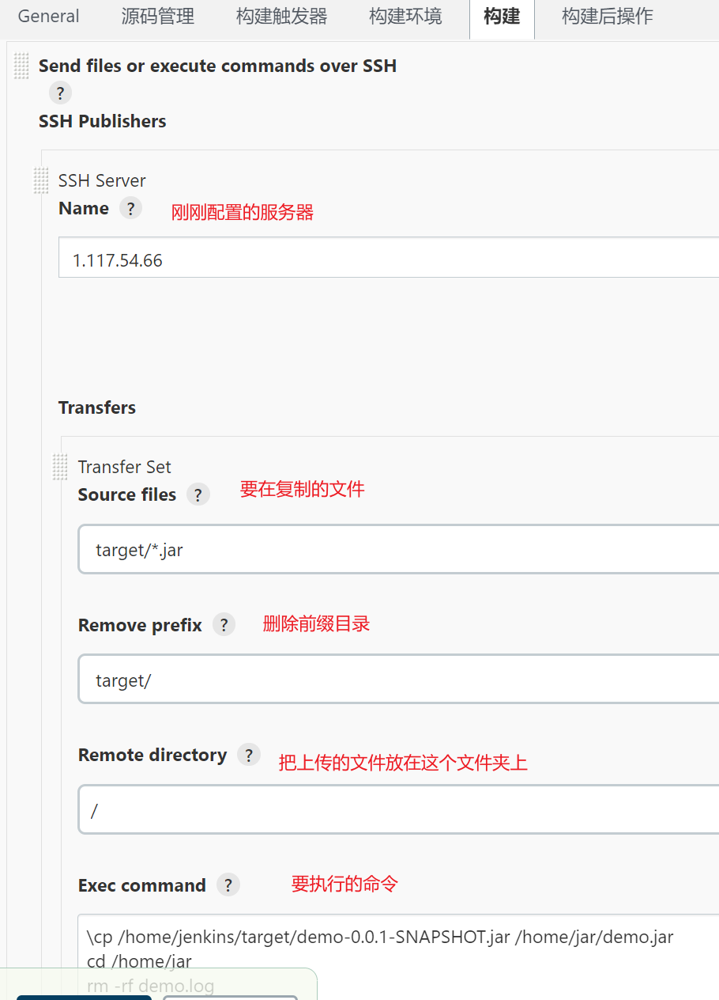

## jenkins插件`Publish Over SSH`

- `Publish Over SSH`可以通过SSH连接其他Linux机器，远程传输文件及执行Shell命令

##### 1.安装插件

> 系统管理 > 插件管理 > 可选插件,搜索`Publish Over SSH`并安装

##### 2.配置Publish Over SSH

> 系统管理 > 系统配置 > 找到`Publish over SSH`标签下的`新增`

##### 3.使用

> 要注意在执行shell命令时显示未知命令时,要在shell脚本上加上环境变量

