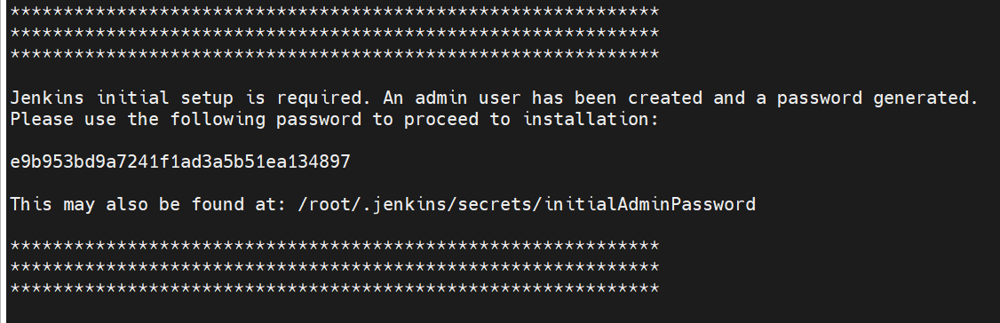
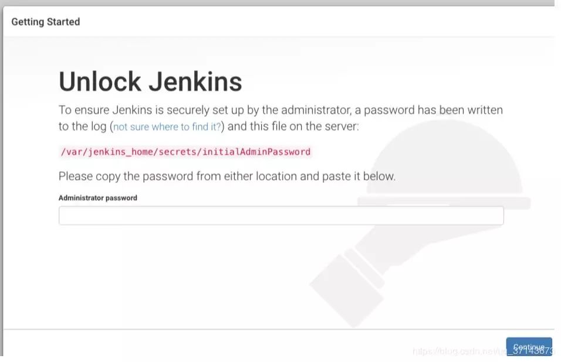
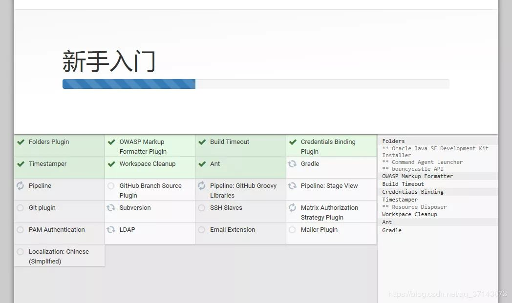
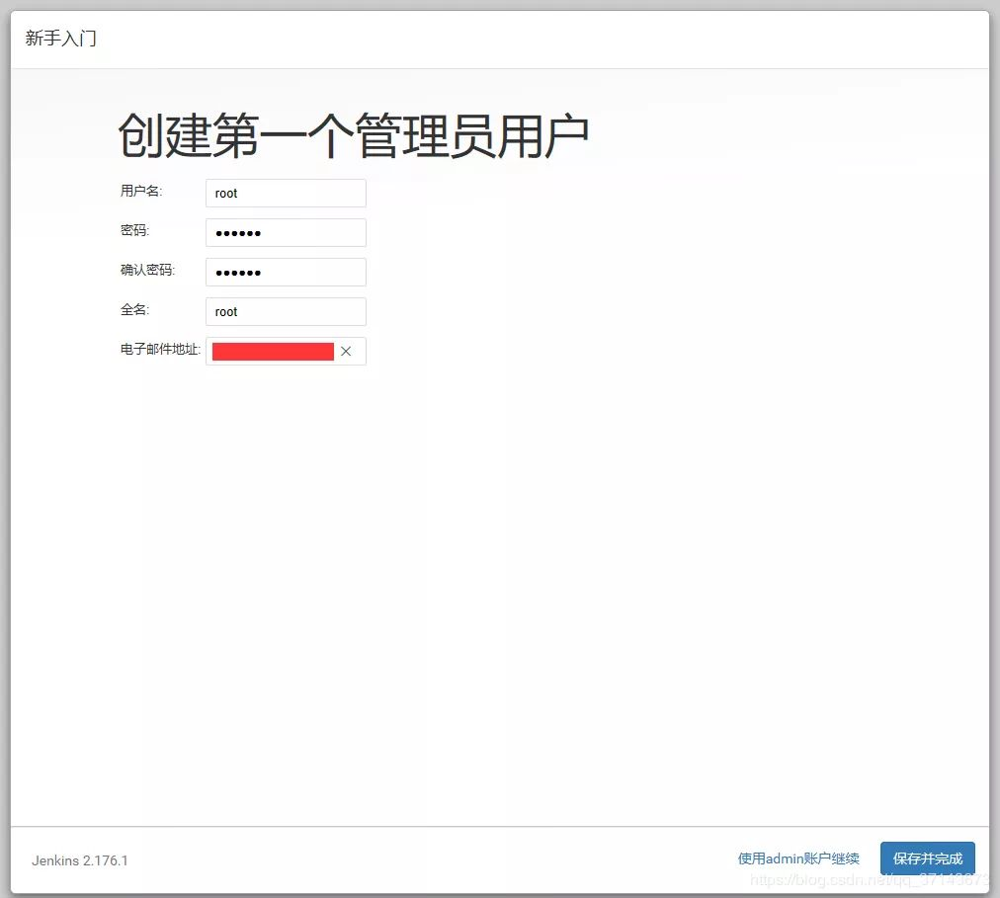

## 安装jenkins

##### 1.下载 https://mirrors.jenkins.io/war-stable/

> 需要提前安装 jdk

##### 2.使用`java -jar jenkins.war --httpPort=9090`启动jenkins

##### 3.在控制台查看初始化密码

##### 4.安装推荐插件

##### 5.创建第一个账号

##### 3.配置环境变量

> 启动完成以后记得配置环境变量,如maven,java等, jenkins主页面->Manage Jenkins->Configure System->Global Properties 中, 将Environment variables复选框选中,会出来List of variables
