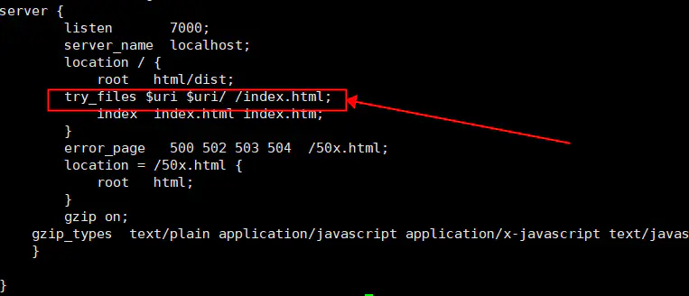

## nginx部署时刷新404

> 我们在用nginx部署时候完项目会出现页面刷新会404，而页面上点击跳转（一般比如点击菜单）页面则不会404，为什么呢，因为你没在nginx配置上面加上重定向跳转。

######  只需要加上这段配置：

```shell
try_files $uri $uri/ /index.html;
```

这句配置的意思是每次匹配url路径时候找不到对应静态资源时候调制跳转到index.html文件



```
server {
    listen       80;
    listen  [::]:80;
    server_name  localhost;

    #access_log  /var/log/nginx/host.access.log  main;

    root  /usr/share/nginx/html/dist;#vue项目的打包后的dist
    #location / {
    #    root   /usr/share/nginx/html;
    #    index  index.html index.htm;
    #}


    location ^~/ {
	    proxy_pass  http://120.46.163.203:8090/; # 后端接口地址，
    }

    location /admin {
        alias /usr/share/nginx/html/dist;
        try_files $uri $uri/ /admin/index.html; 
        index  index.html index.htm;
    }
    
    location /static {
        alias /usr/share/nginx/html/dist/static;
        index  index.html index.htm;
    }

    location /prod-api {
    	 	rewrite ^/prod-api/(.*) /$1 break; #过滤掉接口前缀
   		  proxy_pass  http://120.46.163.203:8080/; # 后端接口地址，
          
        proxy_http_version 1.1;
        proxy_set_header Upgrade $http_upgrade;
        proxy_set_header Connection "upgrade";
    }


    error_page   500 502 503 504  /50x.html;
    location = /50x.html {
        root   /usr/share/nginx/html;
    }

}


```

