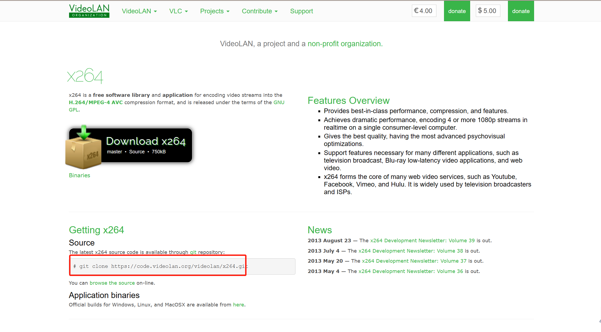

## ffmpeg x264解码器安装

##### 1.下载

https://www.videolan.org/developers/x264.html



#####  2.解压后到根目录执行

```c
./configure --prefix=/usr/local/x264 --enable-shared --enable-static --disable-opencl
    
make & make install
```

##### 3.编译ffmpeg 错误

```c
libavcodec/libx264.c: In function ‘X264_frame’:
libavcodec/libx264.c:282:9: error: ‘x264_bit_depth’ undeclared (first use in this function); did you mean ‘x264_picture_t’?
     if (x264_bit_depth > 8)
         ^~~~~~~~~~~~~~
         x264_picture_t
libavcodec/libx264.c:282:9: note: each undeclared identifier is reported only once for each function it appears in
libavcodec/libx264.c: In function ‘X264_init_static’:
libavcodec/libx264.c:892:9: error: ‘x264_bit_depth’ undeclared (first use in this function); did you mean ‘x264_picture_t’?
     if (x264_bit_depth == 8)
         ^~~~~~~~~~~~~~
         x264_picture_t
make: *** [common.mak:60: libavcodec/libx264.o] Error 1

```

1. 方案一

   找到libx264.c文件 把 x264_bit_depth直接全部替换为X264_BIT_DEPTH，然后重新进行编译

2. 方案二

   到ffmpeg github下载最新的源码进行编译

