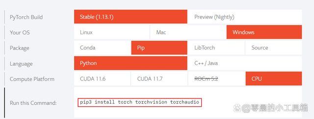

## whisper-mp3转文字

##### whisper介绍

> Open AI在2022年9月21日开源了号称其英文语音辨识能力已达到人类水准的Whisper神经网络，且它亦支持其它98种语言的自动语音辨识。Whisper系统所提供的自动语音辨识（Automatic Speech Recognition，ASR）模型是被训练来运行语音辨识与翻译任务的，它们能将各种语言的语音变成文本，也能将这些文本翻译成英文。

##### 系统环境

官方说他们使用的是Python 3.9.9 and PyTorch 1.10.1来训练和检验的程序，但预计兼容python 3.7以后的版本和pytorch近期更新版本。大家在安装whisper的时候请尽量保证python版本与官方一致或更新版本，或者至少是3.7版本以后，这样可以避免一些版本不同导致的莫名奇妙的错误。本文测试系统为windows11 64位、python版本3.9.13和windows10 64位、python3.7.5版本.

##### 1.安装步骤

whisper的安装不是简简单单一句命令

```
pip install whisper
```

就完事，它还需要一些依赖。比如ffmpeg、pytorch等。本文没涉及python的安装，默认读者是已经安装好python的，如果你不会安装python的话，建议去视频平台搜索安装教程，安装好后再来进行下面的步骤。

##### 2.下载ffmpeg并添加环境变量

参考ffmpeg安装

#####  3.pytorch的安装

这里我们使用pip安装。

打开pytorch.org,下拉页面。

按照下图选择要安装的版本。我选择的是稳定版，windows系统，pip安装方式，python语言、cpu版本的软件。





选择好后上图中框选的那行代码就是使用pip安装pytorch的命令。在命令行界面运行

```
pip3 install torch torchvision torchaudio
```

安装pytorch，安装好后这一步也就完成了。

##### 4.whisper的安装

以上步骤都完成后。按照官方文档，先运行

```
pip install git+https://github.com/openai/whisper.git
```

然后再运行

```
pip install --upgrade --no-deps --force-reinstall git+https://github.com/openai/whisper.git
```

完成whisper的安装。

##### 5.whisper的简单使用

```sh
whisper audio.mp3
```

##### 6.更换转写模型

以上`whisper audio.mp3`的命令形式是最简单的一种，它默认使用的是base模式的模型转写，我们还可以使用更高等级的模型来提高正确率。比如

```
whisper audio.mp3 --model medium
```

使用base模型和medium模型的对比，medium模型耗费时间更长，但也更精准。一般而言，综合权衡速度与精准度，选择base也够用了，如果你对语言识别的精准度高可以使用medium，medium的精准度已经相当高了，如我文章开头所说，我用medium模式识别了我读的一段5min的音频，400多字。正确率基本百分百，只错了2个英文单词，还是因为我发音不准，尴尬。


当然还有其他的模型可供选择，可以在命令行运行`whisper --help`查看帮助。有以下11种模式可供选择。

```
[--model {tiny.en,tiny,base.en,base,small.en,small,medium.en,medium,large-v1,large-v2,large}]
```