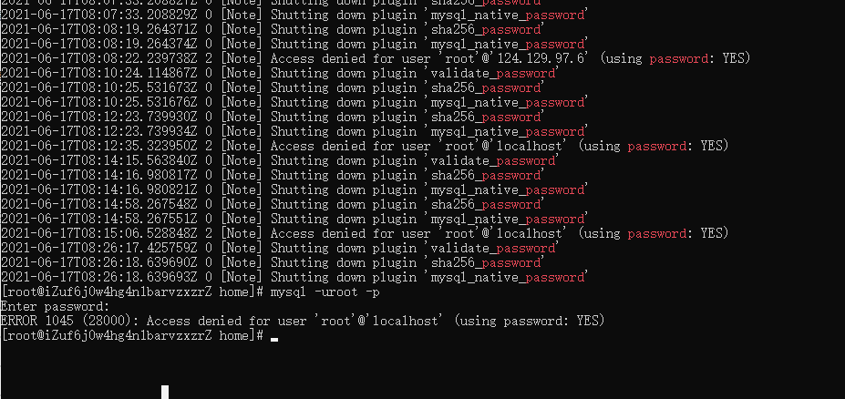

## centos安装Mysql

1. 下载安装
   ```shell
   wget -i -c http://dev.mysql.com/get/mysql57-community-release-el7-10.noarch.rpm
   yum -y install mysql57-community-release-el7-10.noarch.rpm
   yum -y install mysql-community-server
   ```

2. 启动

   ```she
   systemctl start  mysqld.service
   ```

3. 查看运行状态

   ```shell
   systemctl status mysqld.service
   ```

4. 找出密码

   ```she
   grep "password" /var/log/mysqld.log
   ```

5. 设置密码的验证强度等级

   ```shell
   set global validate_password_policy=LOW;
   set global validate_password_length=6;
   ```

6. 修改密码

   ```shell
   ALTER USER 'root'@'localhost' IDENTIFIED BY '123456';
   ```

7. 提示 “访问被拒绝”密码yes

   

> 在/etc/my.cnf下的[mysqd]节点添加 “skip-grant-tables”进行修改密码

```sql
flush privileges;
alter user root@'%' identified by 'lbf123';
update user set password=password('123') where user='root' and host='localhost';  
flush privileges;
```

