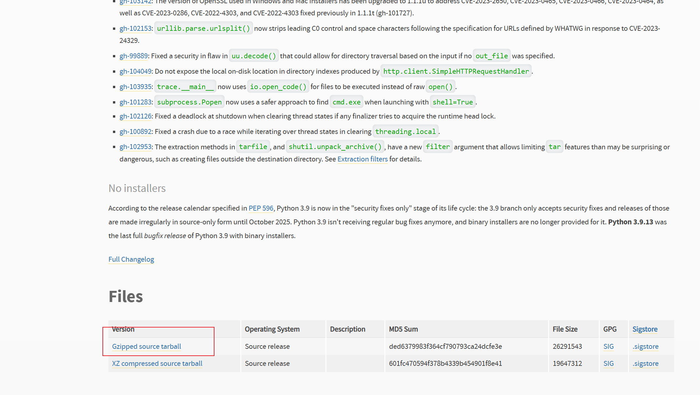

## liunx安装python

#### 1.下载

>下载地址 https://www.python.org/downloads/release/python-3917/



#### 2.执行解压文件 并编译安装

```sh
./configure

make

make install
```

#### 3.解决pip安装慢问题

```sh
#1.下载时加入参数 -i [镜像源地址]
pip install -i https://pypi.tuna.tsinghua.edu.cn/simple torch
#或者
pip install torch -i https://pypi.tuna.tsinghua.edu.cn/simple

#2.设置源
pip config set global.index-url https://pypi.tuna.tsinghua.edu.cn/simple
pip config set install.trusted-host mirrors.aliyun.com

#3.国内镜像源地址
# 阿里云	http://mirrors.aliyun.com/pypi/simple/
# 中国科技大学 	https://pypi.mirrors.ustc.edu.cn/simple/
# 豆瓣	 http://pypi.douban.com/simple
# Python官方	 https://pypi.python.org/simple/
# v2ex	 http://pypi.v2ex.com/simple/
# 中国科学院 	http://pypi.mirrors.opencas.cn/simple/
# 清华大学	 https://pypi.tuna.tsinghua.edu.cn/simple/
```

