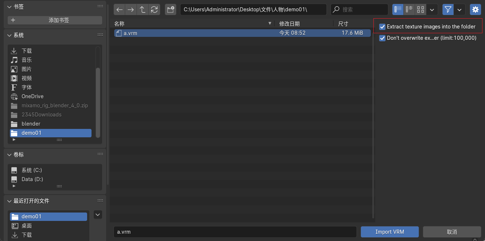

## VRoidStudio导入blender人物建模

##### 1.下载VRoidStudio 并导出 .vrm文件

> 下载地址: https://vroid.com/en/studio

##### 2.安装Cats

> 下载: https://github.com/absolute-quantum/cats-blender-plugin/releases

- 由于此插件没有更新，建议安装blender 2.93 版本，否则可能会报错

##### 3.安装VRM

> 下载: https://github.com/saturday06/VRM-Addon-for-Blender/releases

##### 4.blender导入`vrm`

> 导入时要注意勾选 `Extract texture images into the folder`

