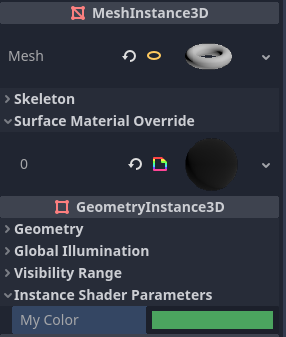

## 着色器

#### 着色器类型

- 用于 3D 渲染的 [spatial](https://docs.godotengine.org/zh-cn/4.x/tutorials/shaders/shader_reference/spatial_shader.html#doc-spatial-shader)。
- 用于 2D 渲染的 [canvas_item](https://docs.godotengine.org/zh-cn/4.x/tutorials/shaders/shader_reference/canvas_item_shader.html#doc-canvas-item-shader)。
- 用于粒子系统的 [particles](https://docs.godotengine.org/zh-cn/4.x/tutorials/shaders/shader_reference/particle_shader.html#doc-particle-shader)。
- 用于渲染 [Skies](https://docs.godotengine.org/zh-cn/4.x/classes/class_sky.html#class-sky) 的 [sky](https://docs.godotengine.org/zh-cn/4.x/tutorials/shaders/shader_reference/sky_shader.html#doc-sky-shader)。
- 用于渲染 [FogVolumes](https://docs.godotengine.org/zh-cn/4.x/classes/class_fogvolume.html#class-fogvolume) 的 [fog](https://docs.godotengine.org/zh-cn/4.x/tutorials/shaders/shader_reference/fog_shader.html#doc-fog-shader)

在 Godot 中，所有的着色器都需要在第一行指定它们的类型，类似这样：

```glsl
shader_type spatial;
```

##### 顶点处理器

在 `spatial` 和 `canvas_item` 着色器中，会为每一个顶点调用一次 `vertex()` 处理函数。

你的世界中的几何体上，每一个顶点都有位置、颜色等属性。该函数会修改这些值，并将其传入片段函数。你也可以借助 varying 向片段着色器传递额外的数据。

默认情况下，Godot 会为你对顶点信息进行变换，这是将几何体投影到屏幕上所必须的。你可以使用渲染模式来自行变换数据；示例见 [Spatial 着色器文档](https://docs.godotengine.org/zh-cn/4.x/tutorials/shaders/shader_reference/spatial_shader.html#doc-spatial-shader)。

##### 片段处理器

`fragment()` 处理函数的作用是设置每一个像素的 Godot 材质属性。这里的代码会在绘制的对象或图元的每一个可见像素上执行。只能在 `spatial`、`canvas_item` 着色器中使用。

片段函数的标准用途是设置用于计算光照的材质属性。例如，你可以为 `ROUGHNESS`、`RIM`、`TRNASMISSION` 等设置值，告诉光照函数光照应该如何处理对应的片段。这样就可以控制复杂的着色管线，而不必让用户编写过多的代码。如果你不需要这一内置功能，那么你可以忽略它，自行编写光照处理函数，Godot 会将其优化掉。例如，如果你没有向 `RIM` 写入任何值，那么 Godot 就不会计算边缘光照。编译时，Godot 会检查是否使用了 `RIM`；如果没有，那么它就会把对应的代码删除。因此，你就不会在没有使用的效果上浪费算力。

##### 光照处理器

`light()` 处理器也会在每一个像素上运行，并且同时还会在每一个影响该对象的灯光上运行。如果没有灯光影响该对象则不会运行。它会被用于 `fragment()` 处理器，一般会在 `fragment()` 函数中进行材质属性设置时执行。


#### Uniform 

##### 使用Uniform 

>  Godot 提供了可选的 uniform 提示，用于让编译器理解 uniform 的用途，以及指示编辑器提供什么样的控件来让用户修改它。

例如：

``` glsl
shader_type spatial;

uniform vec4 color : source_color;
uniform float amount : hint_range(0, 1);
uniform vec4 other_color : source_color = vec4(1.0); // Default values go after the hint.
uniform sampler2D image : source_color;
```

以下是完整的提示列表：

| 类型           | 提示                                             | 描述                                                         |
| -------------- | ------------------------------------------------ | ------------------------------------------------------------ |
| **vec3、vec4** | source_color                                     | 用作颜色。                                                   |
| **int**        | hint_enum("String1", "String2")                  | 在编辑器中以下拉菜单形式显示整数输入。                       |
| **int、float** | hint_range(min, max[, step])                     | 限制取值范围（最小值/最大值/步长）。                         |
| **sampler2D**  | source_color                                     | 用作反照颜色。                                               |
| **sampler2D**  | hint_normal                                      | 用作法线贴图。                                               |
| **sampler2D**  | hint_default_white                               | 作为值或反照颜色，默认为不透明白色。                         |
| **sampler2D**  | hint_default_black                               | 作为值或反照颜色，默认为不透明黑色。                         |
| **sampler2D**  | hint_default_transparent                         | 作为值或反照颜色，默认为透明黑色。                           |
| **sampler2D**  | hint_anisotropy                                  | 作为 FlowMap，默认为右。                                     |
| **sampler2D**  | hint_roughness[_r, _g, _b, _a, _normal, _gray]   | 用于导入时的粗糙度限制器（尝试减少镜面锯齿）。`_normal`是引导粗糙度限制器的法线贴图，在具有高频细节的区域中粗糙度会增加。 |
| **sampler2D**  | filter[_nearest, _linear][_mipmap][_anisotropic] | 启用指定的纹理过滤。                                         |
| **sampler2D**  | repeat[_enable, _disable]                        | 启用纹理重复。                                               |
| **sampler2D**  | hint_screen_texture                              | 纹理是屏幕纹理。                                             |
| **sampler2D**  | hint_depth_texture                               | 纹理是深度纹理。                                             |
| **sampler2D**  | hint_normal_roughness_texture                    | 纹理是法线粗糙度纹理（仅在 Forward+ 中受支持）。             |

你可以通过 GDScript 使用 [set_shader_parameter()](https://docs.godotengine.org/zh-cn/4.x/classes/class_shadermaterial.html#class-shadermaterial-method-set-shader-parameter) 方法设置 uniform 变量：

```py
material.set_shader_parameter("color", some_value)

material.set_shader_parameter("colors", [Vector3(1, 0, 0), Vector3(0, 1, 0), Vector3(0, 0, 1)])
```

##### 使用 `hint_enum`

你可以使用 `hint_enum` uniform，通过一个可读的下拉菜单来访问 `int` 值：

```glsl
uniform int noise_type : hint_enum("OpenSimplex2", "Cellular", "Perlin", "Value") = 0;
```

你可以使用类似于 GDScript 的冒号语法为 `hint_enum` uniform 显式赋值：

```glsl
uniform int character_speed: hint_enum("Slow:30", "Average:60", "Very Fast:200") = 60;
```

该值将作为整数存储，其值为所选选项的索引（例如 `0`/、 `1` 或 `2`/）或通过冒号语法分配的值（例如 `30`/、 `60` 或 `200`/）。当使用 `set_shader_parameter()` 方法设置该值时，必须使用整数而非 `String` 名称。

##### 单实例 uniform

> 单实例 uniform 在 `canvas_item`（2D）和 `spatial`（3D）着色器中均可使用。
>
> 有时，你希望使用材质修改每个节点上的某个参数。例如，在一个充满树木的森林中，你想让每棵树都有一个可以手动调整、略微不同的颜色。若不使用单实例 uniform，则需为每棵树创建单独的材质（每个材质具有略微不同的色相）。这使得材质管理变得复杂，并且由于场景需要更多单独的材质实例，还会产生性能开销。虽然可以使用顶点颜色来实现，但该方法需要为每种不同的颜色创建单独的网格副本，同样会带来性能开销。
>
> 单实例 uniform 设置在每个 GeometryInstance3D 上，而不是在每个材质实例上。在处理指定了多种材质的网格或多重网格设置时，请考虑这一点。

```glsl
shader_type spatial;

// Provide a hint to edit as a color. Optionally, a default value can be provided.
// If no default value is provided, the type's default is used (e.g. opaque black for colors).
instance uniform vec4 my_color : source_color = vec4(1.0, 0.5, 0.0, 1.0);

void fragment() {
    ALBEDO = my_color.rgb;
}
```

在保存着色器后，你可以在检查器中更改单实例 uniform 的值：



单实例 uniform 的值也可在运行时通过调用方法进行设置：

```python
$MeshInstance3D.set_instance_shader_parameter("my_color", Color(0.3, 0.6, 1.0))
```


#### 着色器输入参数

| 变量名          | 类型    | 说明                                                         |
| --------------- | ------- | ------------------------------------------------------------ |
| **`UV`**        | `vec2`  | **纹理坐标**。范围通常在 `(0, 0)` 到 `(1, 1)` 之间。用于从贴图中采样。 |
| **`TIME`**      | `float` | **运行时间**（秒）。用于制作波纹、闪烁、滚动等动态效果。     |
| **`VERTEX`**    | `vec3`  | 经过变换后的**顶点位置**（视图空间）。                       |
| **`COLOR`**     | `vec4`  | 2D着色器中，**顶点颜色** 或 当前像素的初始颜色 |
| **`ALBEDO`**    | `vec3`   | 3D着色器中，**顶点颜色** 或 当前像素的初始颜色 |
| **`ALPHA`**    | `float` | 3D着色器中，设置物体透明通道(0到1之间) |
| **`FRAGCOORD`** | `vec4`  | **屏幕坐标**。`xy` 是像素位置，`z` 是深度。常用于全屏特效。  |
| **`SCREEN_UV`** | `vec2`  | **屏幕空间 UV**。用于获取当前像素在整个屏幕上的比例位置（读取背景缓冲时必备）。 |
| **`NORMAL`**    | `vec3`  | **法线方向**。在 3D 中用于计算光照角度。                     |
| **`NORMAL_MAP`**    | `vec3`  | 设置**法线贴图**，产生极其真实的划痕、凹槽、砖块缝隙等细节 |
| **`ROUGHNESS `**    | `float`  | 粗糙度 |
| **`METALLIC `**    | `float`  | 金属度 |
| **`METALLIC `**    | `float`  | 屏幕坐标：相对于整个屏幕。左上角是 0, 0，右下角是 1, 1 |
| **`SCREEN_UV `**    | `float`  | 金属度 |
#### 着色器内置函数

##### 基础数学函数 (Math Basics)

这些函数是构建逻辑的基石，几乎每个着色器都会用到。

| **函数**                | **功能**  | **说明**                                          |
| ----------------------- | --------- | ------------------------------------------------- |
| **`abs(x)`**            | 绝对值    | 将负数转为正数。                                  |
| **`sign(x)`**           | 取符号    | `x > 0` 返回 1.0，`x < 0` 返回 -1.0，`0` 返回 0。 |
| **`pow(x, y)`**         | 幂运算    | 计算 x^y。常用于调整发光强度或对比度。            |
| **`exp(x)` / `log(x)`** | 指数/对数 | 自然底数 e 的幂或对数。                           |
| **`sqrt(x)`**           | 平方根    | 计算 sqrt{x}。                                    |
| **`mod(x, y)`**         | 取模/求余 | 常用于平铺纹理或创建循环条纹。                    |

##### 数值限制与插值 (Clamping & Interpolation)

这是着色器动画和颜色平滑过渡的**灵魂**。

| **函数**                      | **功能**  | **视觉效果/用途**                                          |
| ----------------------------- | --------- | ---------------------------------------------------------- |
| **`clamp(x, min, max)`**      | 数值截断  | 将 `x` 限制在 `min` 和 `max` 之间。防止颜色溢出。          |
| **`min(a, b)` / `max(a, b)`** | 取小/取大 | 用于混合遮罩或简单的逻辑判断。                             |
| **`mix(a, b, t)`**            | 线性插值  | 根据 `t` (0到1) 在 `a` 和 `b` 之间混合。**最常用的函数**。 |
| **`step(edge, x)`**           | 阶梯函数  | 如果 `x < edge` 返回 0，否则返回 1。常用于制作硬边缘遮罩。 |
| **`smoothstep(e0, e1, x)`**   | 平滑阶梯  | 在 `e0` 和 `e1` 之间产生平滑过渡。                         |

##### 三角函数 (Trigonometry)

用于波浪、圆周运动和旋转。

| **函数**                | **功能**   | **常见场景**                                                 |
| ----------------------- | ---------- | ------------------------------------------------------------ |
| **`sin(x)` / `cos(x)`** | 正弦/余弦  | 圆周运动。当 sin 处于 0（平衡点）时，cos 恰好处于 1（最高点）。 |
| **`tan(x)`**            | 正切       | 较少直接用于视觉，多用于坐标变换。                           |
| **`asin()` / `acos()`** | 反三角函数 | 根据坐标反推角度。                                           |
| **`atan(y, x)`**        | 反正切     | 非常有用！常用于计算 UV 坐标相对于中心的**极坐标角度**。     |

##### 向量与几何函数 (Vector & Geometry)

处理方向、距离和法线。

| **函数**             | **功能** | **场景**                                         |
| -------------------- | -------- | ------------------------------------------------ |
| **`length(v)`**      | 向量长度 | 计算像素到中心点的距离（做圆形遮罩或径向渐变）。 |
| **`distance(a, b)`** | 点间距离 | 计算两点之间的物理距离。                         |
| **`dot(a, b)`**      | 点积     | 计算两个向量的相似度。**3D光照计算的核心**。     |
| **`cross(a, b)`**    | 叉积     | 计算垂直于两向量的法向量。                       |
| **`normalize(v)`**   | 单位化   | 将向量长度变为 1，只保留方向（处理法线必备）。   |
| **`reflect(I, N)`**  | 反射     | 计算入射光线在表面法线上的反射方向。             |

##### 纹理与屏幕函数 (Texture & Screen)

专门用于读取数据。

| **函数**                     | **功能**     | **备注**                                      |
| ---------------------------- | ------------ | --------------------------------------------- |
| **`texture(sampler, uv)`**   | 采样纹理     | 从指定的 `sampler2D` 中读取对应 `UV` 的颜色。 |
| **`textureLod(s, uv, lod)`** | 指定细节采样 | 读取特定模糊程度（Mipmap 层级）的纹理。       |
| **`screen_uv_to_distance`**  | 深度辅助     | 用于计算像素到相机的距离（仅限 3D）。         |

#### 2D着色器实例

##### 2中颜色的跑马灯

```glsl
shader_type canvas_item;

void fragment() {
	vec4 color1 = vec4(1.0, 0.0, 0.0, 1.0);
	vec4 color2 = vec4(0.0, 1.0, 0.0, 1.0);
	float change = (sin(TIME*2.0) + 1.0) * 0.5;
    vec4 color = mix(color1, color2, change);
	COLOR = color;
}
```

##### 背景滚动效果

需要开启Texture - Roneat  = Enabled

```glsl
shader_type canvas_item;

uniform vec2 offset = vec2(1.0, 1.0);
uniform vec2 zoom = vec2(4.0, 4.0);

void vertex(){
	UV = UV * zoom + offset * TIME;
}
```

##### 游戏人物闪光效果

``` glsl
shader_type canvas_item;

// 混合值
uniform float mix_val = 0;

void fragment() {
	// 默认纹理
	vec4 def_texture = texture(TEXTURE, UV);
	// 闪光
	vec4 flashing = vec4(1.0, 1.0, 1.0, def_texture.a);
	COLOR = mix(def_texture, flashing, mix_val);
}
```

##### 背景灰度

```glsl
shader_type canvas_item;

void fragment() {
	vec4 original_color = texture(TEXTURE, UV);
	float grayscale = (original_color.r + original_color.b + original_color.b) / 3.0;
	COLOR = vec4(vec3(grayscale), original_color.a);
}
```

##### 渐变映射

```glsl
shader_type canvas_item;

uniform sampler2D gradient_texture : source_color;

void fragment() {
	vec4 original_color = texture(TEXTURE, UV);
	// 灰度
	float grayscale = (original_color.r + original_color.g + original_color.b) / 3.0;
	// 根据灰度去查表
	vec4 gradient_color = texture(gradient_texture, vec2(grayscale));
	COLOR = vec4(gradient_color.rgb, original_color.a);

}
```

##### 屏幕着色器

```glsl
shader_type canvas_item;

// 获取当前屏幕画面材质
uniform sampler2D screen_texture : hint_screen_texture;

void fragment() {
	// SCREEN_UV (屏幕坐标)：相对于整个屏幕。左上角是 0, 0，右下角是 1, 1
	COLOR = texture(screen_texture, SCREEN_UV);
	COLOR.r = 0.5;
}
```

##### 溶解效果

```glsl
shader_type canvas_item;

// 噪音贴图
uniform sampler2D noise_texture : source_color;
// 溶解百分比
uniform float dissolve_pct : hint_range(0.0, 1.0);

void fragment() {
	vec4 noise_color = texture(noise_texture, UV);
	if (dissolve_pct > noise_color.r) {
		COLOR.a = 0.0;
	}
}
```

##### 背景遮罩

```glsl
shader_type canvas_item;

// 屏幕着色器
uniform sampler2D screen_texture : hint_screen_texture;
// 遮罩
uniform sampler2D mask_texture : source_color;
// 缩放
uniform float zoom = 1.0;

void fragment() {
    // 在中心缩放公式
	vec2 uv = (UV - 0.5) / zoom + 0.5;
	vec4 mask_color = texture(mask_texture, uv);
	vec4 original_color = texture(TEXTURE, UV);

	if (mask_color.r > 0.1) {
		COLOR = texture(screen_texture, SCREEN_UV);
	} else {
		COLOR = mask_color;
	}
}
```

##### 扭曲效果

```glsl
shader_type canvas_item;

uniform sampler2D noise_textur1: source_color,repeat_enable;
uniform sampler2D noise_textur2: source_color,repeat_enable;
uniform vec2 offset1 = vec2(0.1, 0.1);
uniform vec2 offset2 = vec2(0.1, 0.1);

// 溶解成度
uniform float distortion_strength = 0.1;

void fragment() {
	// 滚动噪声纹理
	vec4 noise_color1 = texture(noise_textur1,  UV + offset1 * TIME);
	vec4 noise_color2 = texture(noise_textur2, UV + offset2 * TIME);
	float final_noise = noise_color1.r * noise_color2.r;

	vec4 dissolve_color = texture(TEXTURE, UV + final_noise * distortion_strength);
	vec4 original_color = texture(TEXTURE, UV);

	COLOR = vec4(dissolve_color.rgb, original_color.a);
}
```

#### 3D着色器实例

##### 水着色器

```glsl
shader_type spatial;
render_mode specular_toon;

// 水的颜色
uniform vec3 color : source_color;
// 噪音材质
uniform sampler2D noise_texture1:source_color, repeat_enable;
uniform sampler2D noise_texture2:source_color, repeat_enable;
// 偏离
uniform vec2 offset1 = vec2(0.1);
uniform vec2 offset2 = vec2(0.1);

void fragment() {
	vec4 normal_color1 = texture(noise_texture1, UV + offset1 * TIME);
	vec4 normal_color2 = texture(noise_texture1, UV + offset2 * TIME);
	
	vec4 final_normal_color = mix(normal_color1, normal_color2, 0.5);
	
	NORMAL_MAP = vec3(final_normal_color.rgb);
	
	METALLIC = 0.0;
	ROUGHNESS = 0.01;
  	ALBEDO = color;	
}
```


