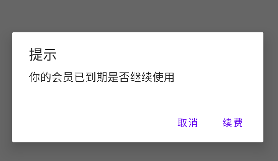

## android AlertDialog弹框

例如:

 

```java
AlertDialog.Builder builder = new AlertDialog.Builder(this);
//标题
builder.setTitle("提示");
//提示内容
builder.setMessage("你的会员已到期是否继续使用");
//确定按钮
builder.setPositiveButton("续费",(dialog,which) ->{
    //成功回调
});
//取消按钮
builder.setNegativeButton("取消",(dialog,which) ->{
    //取消回调
});

builder.show();
```

- setTitle设置标题
-  setIcon设置对话框图标
-  setMessage简单消息框
-  setItems设置要在对话框中显示的项目列表
-  setView设置自定义的对话框样式
-  setSingleChoiceItems设置对话框显示一个单选框
-  setMultiChoiceItems设置对话框显示一系列的复选框
-  setPositiveButton设置对话框显示一个确定的按钮
-  setNeutralButton设置对话框显示一个退出按钮
-  setNegativeButton 设置对话框显示一个取消按钮
-  create创建一个AlertDialog对话框
-  show显示对话框