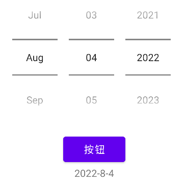
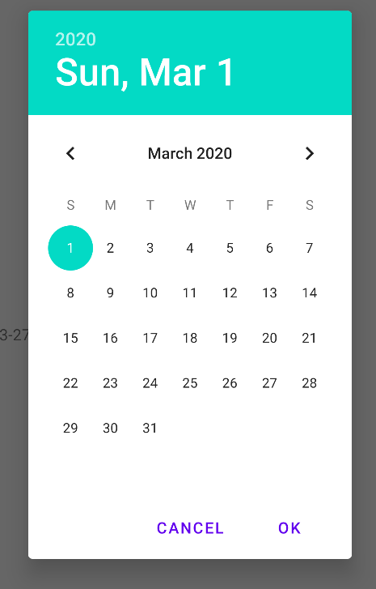

## android 中DatePicker和DatePickerDialog

#### 1.DatePicker(日期选择)

> DatePicker 不可以弹窗

 

```xml
<DatePicker
    android:layout_width="wrap_content"
    android:layout_height="wrap_content"
    android:datePickerMode="spinner"
    android:calendarViewShown="false">
</DatePicker>
```

- datePickerMode `spinner` 定义为滚筒模式
- calendarViewShown `false` 去掉日历

##### 2.DatePickerDialog(日期选择弹框)

 

```java
DatePickerDialog datePickerDialog = new DatePickerDialog(this, (view, year, month,  dayOfMonth) -> {
    //选择成功回调
    System.out.printf("%s-%s-%s%n",year,month+1,dayOfMonth);
},2020,2,1);

datePickerDialog.show();
```