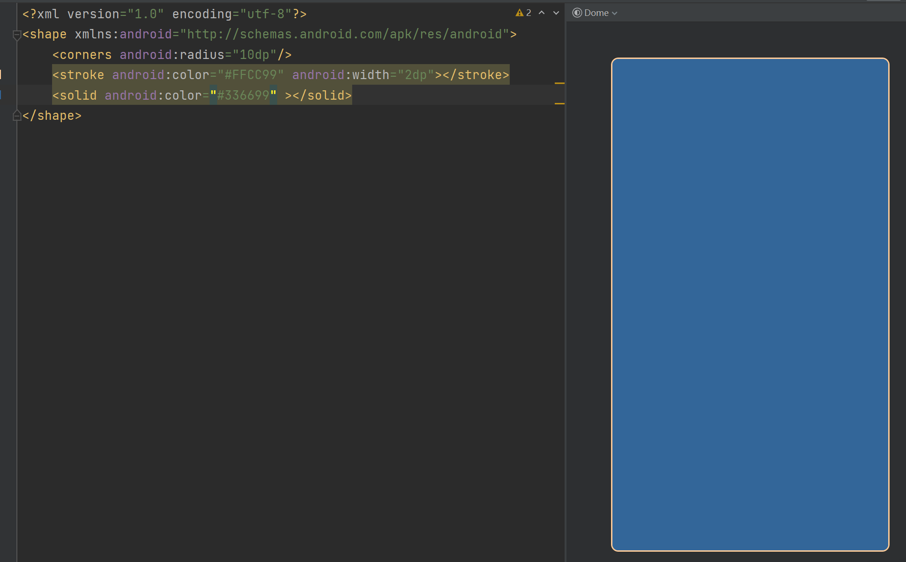

## shape 文件

#### 设置容器圆弧 、背景、边框

```xml
<?xml version="1.0" encoding="utf-8"?>
<shape xmlns:android="http://schemas.android.com/apk/res/android">
    <corners android:radius="10dp"/>
    <stroke android:color="#FFCC99" android:width="2dp"></stroke>
    <!--<solid android:color="#336699" ></solid>-->
</shape>
```

- <corners android:radius="10dp"/> 设置圆弧10dp

- <stroke android:color="#FFCC99" android:width="2dp"></stroke> 设置边框2dp,颜色为#FFCC99

- <solid android:color="#336699" ></solid> 设置实心颜色#336699



#### 点击按压效果

```xml
<?xml version="1.0" encoding="utf-8"?>
<selector xmlns:android="http://schemas.android.com/apk/res/android">
    <item android:state_pressed="true">
        <shape>
            <corners android:radius="5dp"/>
            <stroke android:width="2dp" android:color="#99CC00"/>
            <solid android:color="#FFCC99"></solid>
        </shape>
    </item>
    <item android:state_pressed="false">
        <shape>
            <corners android:radius="5dp"/>
            <stroke android:width="2dp" android:color="#666600"/>
            <solid android:color="#003300"></solid>
        </shape>
    </item>
</selector>
```

- <item android:state_pressed="true">  按压时

-  <item android:state_pressed="false"> 正常时